电子政务是对现有的政府形态的一种改造，利用信息技术和其他相关技术，将其管理和服务职能进行集成，在网络上实现政府组织结构和工作流程优化重组。与电子政务相关的行为主体有三个，即政府、企（事）业单位及居民。国家和地方人口信息的采集、处理和利用，属于政府对政府的电子政务活动。
计算机流水线执行周期=最慢那个指令执行时间；

流水线执行时间=首条指令执行时间+（指令总数-1）*流水线执行周期；

流水线吞吐率=任务数/完成时间；

最大吞吐率=1/最慢的指令执行时间

流水线加速比=不采用流水线的执行时间/采用流水线的执行时间；

# 3. 数据库系统

## 3.1. 数据库系统常识

数据库系统DBS的组成：数据库、硬件、软件、人员。

数据库管理系统DBMS的功能：数据定义、数据库操作、数据库运行管理、数据的存储管理、数据库的建立和维护等。

DBMS的分类：关系数据库系统RDBS、面向对象的数据库系统OODBS、对象关系数据库系统ORDBS。

数据库系统的体系结构：集中式数据库系统(所有东西集中在DBMS电脑上)、客户端/服务器体系结构(客户端负责请求和数据表示，服务器负责数据库服务)、并行数据库系统(多个物理上在一起的CPU)、分布式数据库系统(物理上分布在不同地方的计算机)。

## 3.2. 三级模式-两级映像

内模式：管理如何存储物理的数据，对数据的存储方式、优化、存放等。

模式：又称为概念模式，就是我们通常使用的表这个级别，根据应用、需求将物理数据划分成一
张张表。

外模式：对应数据库中的视图这个级别，将表进行一定的处理后再提供给用户使用。例如，将用户表中的用户名和密码组成视图提供给登录模块使用，而用户表中的其他列则不对该模块开放，增加了安全性。

外模式一模式映像：是表和视图之间的映射，存在于概念级和外部级之间，若表中数据发生了修改，只需要修改此映射，而无需修改应用程序。

模式一内模式映像：是表和数据的物理存储之间的映射，存在于概念级和内部级之间，若修改了数据存储方式，只需要修改此映射，而不需要去修改应用程序。
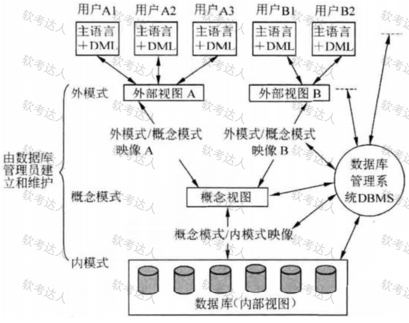

## 3.3. 数据库的设计

需求分析：即分析数据存储的要求，产出物有数据流图、数据字典、需求说明书。获得用户对系统的三个要求：信息要求、处理要求、系统要求。

概念结构设计：就是设计E-R图，也即实体-联系图，与物理实现无关，就是说明有哪些实体，实体有哪些属性。工作步骤包括：选择局部应用、逐一设计分E-R图、E-R图合并。

E-R图进行合并：它们之间存在的冲突主要有以下3类：

属性冲突。同一属性可能会存在于不同的分E-R图中，由于设计人员不同或是出发点不同，对属性的类型、取值范围、数据单位等可能会不一致。

命名冲突。相同意义的属性，在不同的分E-R图上有着不同的命名，或是名称相同的属性在不同的分E-R图中代表着不同的意义。

结构冲突。同一实体在不同的分E-R图中有不同的属性，同一对象在某一分E-R图中被抽象为实体而在另一分E-R图中又被抽象为属性。

逻辑结构设计：将E-R图，转换成关系模式，也即转换成实际的表和表中的列属性，这里要考虑很多规范化的东西。工作步骤包括：确定数据模型、将E-R图转换成为指定的数据模型、确定完整性约束和确定用户视图。

物理设计：根据生成的表等概念，生成物理数据库。工作步骤包括确定数据分布、存储结构和访问方式。

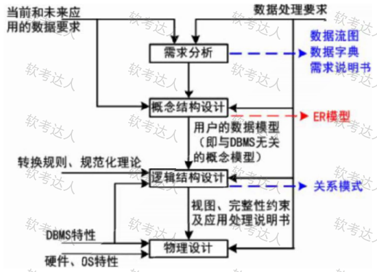

数据库实施阶段：数据库设计人员根据逻辑设计和物理设计阶段的结果建立数据库，编制与调试应用程序，组织数据入库，并进行试运行。

数据库运行和维护阶段：数据库应用系统经过试运行即可投入运行，但该阶段需要不断地对系统进行评价、调整与修改。

## 3.4. E-R模型

数据模型的三要素：数据结构、数据操作、数据的约束条件。

在E-R模型中，使用椭圆表示属性(一般没有)、长方形表示实体、菱形表示联系，联系的两端要填写联系类型，示例如下图：

# 7. 系统配置与性能评价

## 7.1 性能指标

**性能指标：** 是软、硬件、的性能指标的集成。在硬件中，包括计算机、各种通信交换设备、各类网络设备等；在软件中，包括：操作系统、协议以及应用程序等。

**对计算机评价的主要性能指标有：** 时钟频率(主频)；运算速度；运算精度；内存的存储容量；存储器的存取周期；数据处理速率PDR(processingdatarate)；吞吐率；各种响应时间；各种利用率；RASIS特性(即：可靠性Reliability、可用性Availability、可维护性Sericeability、完整性和安全性IntegraityandSecurity)；平均故障响应时间；兼容性；可扩充性；性能价格比。

**对路由器评价的主要性能指标有：** 设备吞吐量、端口吞吐量、全双工线速转发能力、背靠背帧数、路由表能力、背板能力、丢包率、时延、时延抖动、VPN支持能力、内部时钟精度、队列管理机制、端口硬件队列数、分类业务带宽保证、RSVP、IPDiffServ、CAR支持、冗余、热插拔组件、路由器冗余协议、网管、基于Web的管理、网管类型、带外网管支持、网管粒度、计费能力/协议、分组语音支持方式、协议支持、语音压缩能力、端口密度、信令支持。

**对交换机评价的主要性能指标有：** 交换机类型、配置、支持的网络类型、最大ATM端口数、最大SONET端口数、最大FDDI端口数、背板吞吐量、缓冲区大小、最大MAC地址表大小、最大电源数、支持协议和标准、路由信息协议RIP、RIP2、开放式最短路径优先第2版、边界网关协议BGP、无类域间路由CIDR、互联网成组管理协议IGMP、距离矢量多播路由协议DVMRP、开放式最短路径优先多播路由协议MOSPF、协议无关的多播协议PIM、资源预留协议RSVP、802.1p优先级标记，多队列、路由、支持第3层交换、支持多层(4到7层交换、支持多协议路由、支持路由缓存、可支持最大路由表数、VLAN、最大VLAN数量、网管、支持网管类型、支持端口镜像、QoS、支持基于策略的第2层交换、每端口最大优先级队列数、支持基于策略的第3层交换、支持基于策略的应用级QoS、支持最小/最大带宽分配、冗余、热交换组件(管理卡，交换结构，接口模块，电源，冷却系统、支持端口链路聚集协议、负载均衡。

**评价网络的性能指标有：** 设备级性能指标、网络级性能指标、应用级性能指标、用户级性能指标、吞吐量。

**评价操作系统的性能指标有：** 系统的可靠性、系统的吞吐率(量)、系统响应时间、系统资源利用率、可移植性。

**衡量数据库管理系统的主要性能指标包括数据库本身和管理系统两部分，有：** 数据库的大小、数据库中表的数量、单个表的大小、表中允许的记录(行)数量、单个记录(行)的大小、表上所允许的索引数量、数据库所允许的索引数量、最大并发事务处理能力、负载均衡能力、最大连接数等等。

**评价Web服务器的主要性能指标有：** 最大并发连接数、响应延迟、吞吐量。

## 7.2 性能评价方法

**性能评测的常用方法：**  
(1)时钟频率。一般来讲，主频越高，速度越快。  
(2)指令执行速度。计量单位KIPS、MIPS。  
(3)等效指令速度法。统计各类指令在程序中所占比例，并进行折算，是一种固定比例法。  是通过各类指令在程序中所占的比例（Wi）进行计算得到的。
(4)数据处理速率(ProcessingDataRate，PDR)法。采用计算PDR值的方法来衡量机器性能，PDR值越大，机器性能越好。PDR与每条指令和每个操作数的平均位数以及每条指令的平均运算速度有关。

**基准程序法(Benchmark)：** 把应用程序中用得最多、最频繁、的那部分核心程序作为评价计算机性能的标准程序，称为基准测试程序(benchmark)。

把应用程序中用得最多、最频繁的那部分核心程序作为评估计算机系统性能的标准程序，称为基准测试程序（benchmark）。基准程序法不但考虑到了CPU（有时包括主存）的性能，还将I/O结构、操作系统、编译程序的效率等对系统性能的影响考虑进来了，所以它是目前一致承认的测试系统性能的较好方法。

**目前被用户一致承认的测试性能的较好方法，有多种多样的基准程序，包括：**

(1)整数测试程序。同一厂家的机器，采用相同的体系结构，用相同的基准程序测试，得到的MIPS值越大，一般说明机器速度越快。

(2)浮点测试程序。指标MFLOPS(理论峰值浮点速度)。

(3)SPEC基准程序(SPECBenchmark)。重点面向处理器性能的基准程序集，将被测计算机的执行时间标准化，即将被测计算机的执行时间除以一个参考处理器的执行时间，

(4)TPC基准程序。用于评测计算机在事务处理、数据库处理、企业管理与决策支持系统等方面的性能。其中，TPC-C是在线事务处理(On-lineTransactionProcessing，OLTP)的基准程序，TPC-D是决策支持的基准程序。TPC-E作为大型企业信息服务的基准程序。

**大多数情况下，为测试新系统的性能，用户必须依靠评价程序来评价机器的性能。下面列出了4**种评价程序，它们评测的准确程度依次递减：真实的程序、核心程序、小型基准程序、合成基准程序。

## 7.3 阿姆达尔解决方案

阿姆达尔(Amdahl)定律主要用于系统性能改进的计算中。

**阿姆达尔定律：** 是指计算机系统中对某一部件采用某种更快的执行方式所获得的系统性能改变程度，取决于这种方式被使用的频率，或所占总执行时间的比例。

**阿姆达尔定律定义了采用特定部件所取得的**加速比 **。假定我们使用某种增强部件，计算机的性能 **就会得到提高，那么加速比就是下式所定义的比率：

# 10.软件工程基础知识

## 10.1 软件工程

**软件开发生命周期：**  
软件定义时期：包括可行性研究和详细需求分析过程，任务是确定软件开发工程必须完成的总目标，具体可分成问题定义、可行性研究、需求分析等。  
软件开发时期：就是软件的设计与实现，可分成概要设计、详细设计、编码、测试等。  
软件运行和维护：就是把软件产品移交给用户使用。

软件系统的文档可以分为**用户文档**和**系统文档**两类，用户文档主要描述系统功能和使用方法，并不关系这些功能是怎样实现的；系统文档描述系统设计、实现和测试等各方面的内容。

**软件工程过程是指为获得软件产品，在软件工具的支持下由软件工程师完成的一系列软件工程**  活动，包括以下4个方面。  
(1)P(Plan)——软件规格说明。规定软件的功能及其运行时的限制。  
(2)D(Do)——软件开发。开发出满足规格说明的软件。  
(3)C(Check)——软件确认。确认开发的软件能够满足用户的需求。  
(4)A(Action)——软件演进。软件在运行过程中不断改进以满足客户新的需求。

**软件系统工具通常可以按软件过程活动将软件工具分为软件开发工具、软件维护工具、软件管** 理和软件支持工具。

**软件开发工具：** 需求分析工具、设计工具、编码与排错工具、测试工具等。

**软件维护工具：** 版本控制工具、文档分析工具、开发信息库工具、逆向工程工具、再工程工具。

**软件管理和软件支持工具：** 项目管理工具、配置管理工具、软件评价工具、软件开发工具的评价和选择。

**软件设计**包括四个既独立又相互联系的活动，即数据设计、架构(体系结构)设计、人机界面(接口)设计和过程设计，这四个活动完成以后就得到了全面的软件设计模型。

## 10.2 需求工程

### 10.2.1 软件需求

软件需求是指用户对系统在功能、行为、性能、设计约束等方面的期望。是指用户解决问题或达到目标所需的条件或能力，是系统或系统部件要满足合同、标准、规范或其他正式规定文档所需具有的条件或能力，以及反映这些条件或能力的文档说明分为需求开发和需求管理两大过程，如下所示：

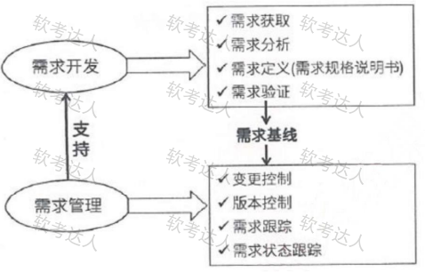

**业务需求：** 反映企业或客户对系统高层次的目标要求，通常来自项目投资人、客户、市场营销部门或产品策划部门。通过业务需求可以确定项目视图和范围。

**用户需求：** 描述的是用户的具体目标，或用户要求系统必须能完成的任务。即描述了用户能使用系统来做什么。通常采取用户访谈和问卷调查等方式，对用户使用的场景进行整理，从而建立用户需求。

**系统需求：** 从系统的角度来说明软件的需求，包括功能需求、非功能需求和设计约束等。

1)功能需求：也称为行为需求，规定了开发人员必须在系统中实现的软件功能，用户利用这些功能来完成任务，满足业务需要。

2)非功能需求：指系统必须具备的属性或品质，又可以细分为软件质量属性(如可维护性、可靠性、效率等)和其他非功能需求。

3)设计约束：也称为限制条件或补充规约，通常是对系统的一些约束说明，例如必须采用国有自主知识产权的数据库系统，必须运行在UNIX操作系统之下等。

### 10.2.2 需求获取

**需求获取**是一个确定和理解不**同的项目干系人的需求和约束的过程**。

**常见的需求获取法包括：**

(1)用户访谈：1对1-3,有代表性的用户。其形式包括结构化和非结构化两种。

(2)问卷调查：用户多，无法一一访谈。

(3)采样：从种群中系统地选出有代表性的样本集的过程。样本数量=0.25*(可信度因子/错误率)2

(4)情节串联板：一系列图片，通过这些图片来讲故事。

(5)联合需求计划(JRP):通过联合各个关键用户代表、系统分析师、开发团队代表一起，通过有组织的会议来讨论需求。

(6)需求记录技术：任务卡片、场景说明、用户故事、Volere白卡。

### 10.2.3 需求分析

一个好的需求应该具有**无二义性、完整性、一致性、可测试性、确定性、可跟踪性、正确性、必要性**等特性，因此，需要分析人员把杂乱无章的用户要求和期望转化为用户需求，这就是需求分析的工作。

**需求分析的任务:**  
(1)绘制系统上下文范围关系图  
(2)创建用户界面原型  
(3)分析需求的可行性  
(4)确定需求的优先级  
(5)为需求建立模型  
(6)创建数据字典  
(7)使用QFD(质量功能部署)

**结构化的需求分析的结构化特点：** 自顶向下，逐步分解，面向数据。

**结构化的需求分析的三大模型：** 功能模型(数据流图)、行为模型(状态转换图)、数据模型(E-R图)以及数据字典

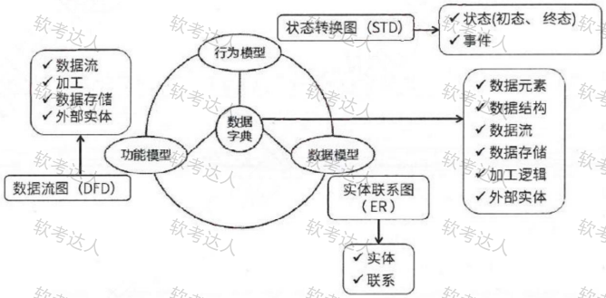

**数据流图DFD基本图形元素：** 外部实体、加工、数据存储、数据流。

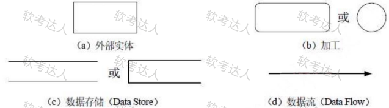

1)数据流：由一组固定成分的数据组成，表示数据的流向。在DFD中，数据流的流向可以有以下几种：从一个加工流向另一个加工；从加工流向数据存储(写);从数据存储流向加工(读);从外部实体流向加工(输入);从加工流向外部实体(输出)。

2)加工：描述了输入数据流到输出数据流之间的变换，也就是输入数据流经过什么处理后变成了输出数据流。数据流图中常见的三种错误如图所示：加工3.1.2有输入但是没有输出，称之为“黑洞”。加工3.1.3有输出但没有输入。称之为“奇迹”。加工3.1.1中输入不足以产生输出，我们称之为“灰洞”。这有几种可能的原因：一个错误的命名过程；错误命名的输入或输出；不完全的事实。灰洞是最常见的错误，也是最使人为难的错误。一旦数据流图交给了程序员，到一个加工的输入数据流必须足以产生输出数据流。

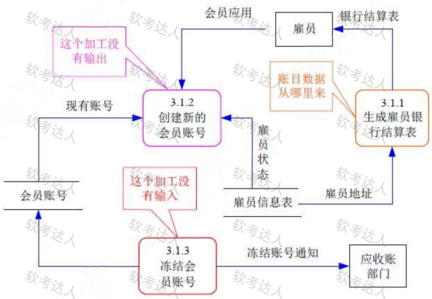

3)数据存储：用来存储数据。在软件系统中还常常要把某些信息保存下来以供以后使用。

4)外部实体(外部主体):是指存在于软件系统之外的人员或组织，它指出系统所需数据的发源地(源)和系统所产生的数据的归宿地(宿)。

分层数据流图：

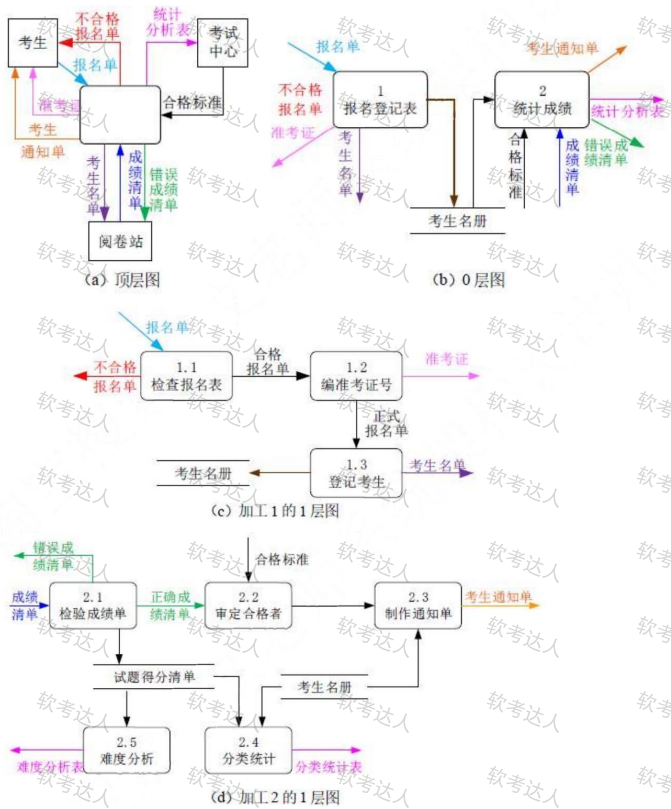

**数据字典DD:** 数据流图描述了系统的分解，但没有对图中各成分进行说明。数据字典就是为数据流图中的每个数据流、文件、加工，以及组成数据流或文件的数据项做出说明。

**数据字典有以下4类条目：** 数据流、数据项、数据存储和基本加工。

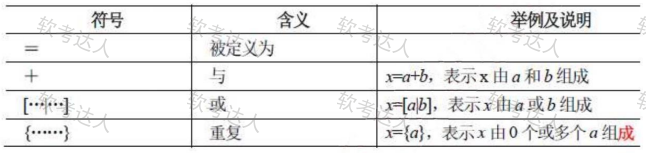

加工逻辑也称为“小说明”。常用的加工逻辑描述方法有结构化语言、判定表和判定树3种。

### 10.2.4 需求定义

**软件需求规格说明书SRS：** 是需求开发活动的产物，编制该文档的目的是使项目干系人与开发团队对系统的初始规定有一个共同的理解，使之成为整个开发工作的基础。SRS是软件开发过程中最重要的文档之一，对于任何规模和性质的软件项目都不应该缺少。

**需求定义方法:**

(1)严格定义也称为预先定义，需求的严格定义建立在以下的基本假设之上：所有需求都能够被预先定义。开发人员与用户之间能够准确而清晰地交流。采用图形(或文字)可以充分体现最终系统。

(2)原型方法，迭代的循环型开发方式，需要注意的问题：并非所有的需求都能在系统开发前被准确地说明。项目干系人之间通常都存在交流上的困难，原型提供了克该服困难的一个手段。特点：需要实际的、可供用户参与的系统模型。有合适的系统开发环境。反复是完全需要和值得提倡的，需求一旦确定，就应遵从严格的方法。

### 10.2.5 需求验证

**需求验证也称为需求确认，目的是与用户一起确认需求无误，对需求规格说明书SAS进行评审和测试，包括两个步骤：**  
需求评审：正式评审和非正式评审。  
需求测试：设计概念测试用例。

**需求验证通过后，要请用户签字确认，作为验收标准之一，此时，这个需求规格说明书就是需求**基线，不可以再随意更新，如果需要更改必须走需求变更流程。

### 10.2.6 需求管理

**定义需求基线：** 通过了评审的需求说明书就是需求基线，下次如果需要变更需求，就需要按照流程来一步步进行。需求的流程及状态如下图所示：

**需求变更和风险：** 主要关心需求变更过程中的需求风险管理，带有风险的做法有：无足够用户参与、忽略了用户分类、用户需求的不断增加、模棱两可的需求、不必要的特性、过于精简的SRS、不准确的估算。

**变更产生的原因：** 外部环境的变化、需求和设计做的不够完整、新技术的出现、公司机构重组造成业务流程的变化。

**变更控制委员会CCB：** 也称为配置控制委员会，其任务时对建议的配置项变更做出评价、审批，以及监督已经批准变更的实施。

**需求跟踪：** 双向跟踪，两个层次，如下图所示：

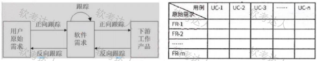

**正向跟踪**表示用户原始需求是否都实现了，**反向跟踪**表示软件实现的是否都是用户要求的，不多不少，可以用原始需求和用例表格(需求跟踪矩阵)来表示：若原始需求和用例有对应，则在对应栏打对号，若某行都没有对号，表明原始需求未实现，正向跟踪发现问题；若某列都没有对号，表明有多余功能用例，软件实现了多余功能，反向跟踪发现问题。

## 10.3 系统设计

### 10.3.1 处理流程设计

**程序流程图**(ProgramFlowDiagram,PFD)用一些图框表示各种操作，它独立于任何一种程序设计语言，比较直观、清晰，易于学习掌握。任何复杂的程序流程图都应该由顺序、选择和循环结构组合或嵌套而成。

**IPO图**也是流程描述工具，用来描述构成软件系统的每个模块的输入、输出和数据加工。

**N-S图**容易表示嵌套和层次关系，并具有强烈的结构化特征。但是当问题很复杂时，N-S图可能很大，因此不适合于复杂程序的设计。

**问题分析图(PAD)** 是一种支持结构化程序设计的图形工具。PAD具有清晰的逻辑结构、标准化的图形等优点，更重要的是，它引导设计人员使用结构化程序设计方法，从而提高程序的质量。

**业务流程重组BPR**

BPR是对企业的业务流程进行根本性的再思考和彻底性的再设计，从而获得可以用诸如成本、质量、服务和速度等方面的业绩来衡量的显著性的成就。BPR设计原则、系统规划和步骤如下图所示：

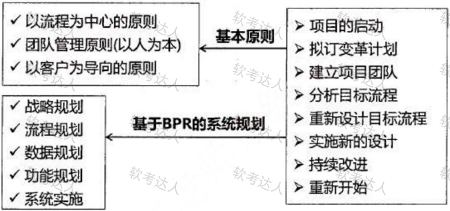

**业务流程管理BPM**  
BPM是一种以规范化的构造端到端的卓越业务流程为中心，以持续的提高组织业务绩效为目的的系统化方法。

**BPM与BPR管理思想最根本的不同就在于**流程管理并不要求对所有的流程进行再造。**构造卓越** 的业务流程并不是流程再造，而是根据现有流程的具体情况，对流程进行规范化的设计流程管理包含三个层面：规范流程、优化流程和再造流程

### 10.3.2 系统设计

**系统设计主要目的：** 为系统制定蓝图，在各种技术和实施方法中权衡利弊，精心设计，合理地使用各种资源，最终勾画出新系统的详细设计方法。

**系统设计方法：** 结构化设计方法，面向对象设计方法。

**系统设计的主要内容：** 概要设计、详细设计。

**概要设计基本任务：** 又称为系统总体结构设计，是将系统的功能需求分配给软件模块，确定每个模块的功能和调用关系，形成软件的模块结构图，即系统结构图。

**详细设计的基本任务：** 模块内详细算法设计、模块内数据结构设计、数据库的物理设计、其他设计(代码、输入/输出格式、用户界面)、编写详细设计说明书、评审。

**系统设计基本原理:**  
抽象化；  
自顶而下，逐步求精；  
信息隐蔽；  
模块独立(高内聚，低耦合)。

**系统设计原则:**  
保持模块的大小适中；  
尽可能减少调用的深度；  
多扇入，少扇出；  
单入口，单出口；  
模块的作用域应该在模块之内；  
功能应该是可预测的。

内聚程度从低到高如下表所示：

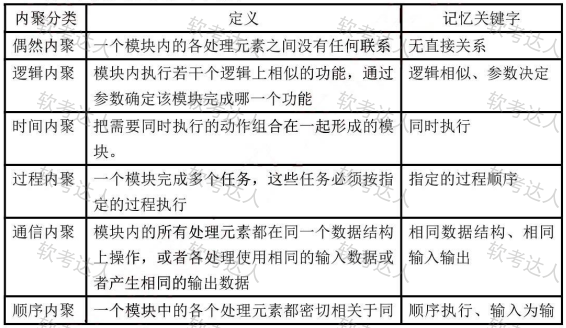

耦合程度从低到高如下所示：

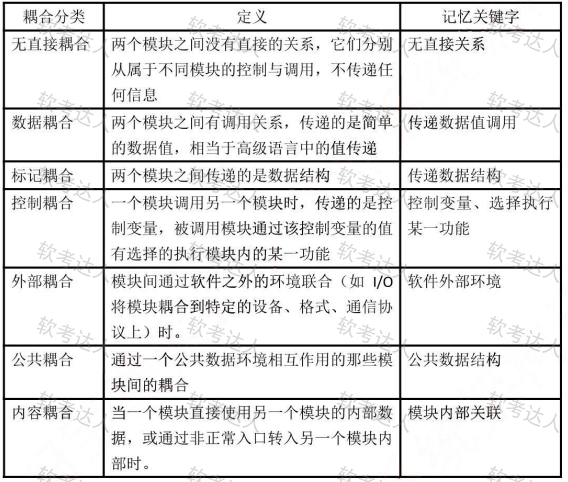

**系统结构图(SC)又称为模块结构图**，它是软件概要设计阶段的工具，反映系统的功能实现和模块之间的联系与通信，包括各模块之间的层次结构，即反映了系统的总体结构。

详细设计的表示工具有图形工具、表格工具和语言工具。其中图形工具有业务流图、程序流程图、PAD图、NS流程图。

**程序流程图又称为程序框图，是使用最广泛然的一种描述程序逻辑结构的工具。它用方框表示一个处理步骤，菱形表示一个逻辑条件，箭头表示控制流向。**  
其优点是：结构清晰，易于理解，易于修改。  
缺点是：只能描述执行过程而不能描述有关的数据。

**NS流程图，也称为盒图，是一种强制使用结构化构造的图示工具，也称为方框图。**  
其具有以下特点：功能域明确、不可能任意转移控制、很容易确定局部和全局数据的作用域、很容易表示嵌套关系及模板的层次关系。

**PAD图**是一种改进的图形描述方式，可以用来取代程序流程图，相比程序流程图更直观，结构更清晰。最大的优点是能够反映和描述自顶向下的历史和过程。PAD提供了5种基本控制结构的图示，并允许递归使用。

### 10.3.3 人机界面设计

**人机界面设计的三大原则：** 置于用户控制之下、减少用户的记忆负担、保持界面的一致性。

**置于用户的控制之下:**  
以不强迫用户进入不必要的或不希望的动作的方式来定义交互方式；  
提供灵活的交互；  
允许用户交互可以被中断和取消；  
当技能级别增加时可以使交互流水化并允许定制交互；  
使用户隔离内部技术细节；  
设计应允许用户和出现在屏幕上的对象直接交互。

**减少用户的记忆负担:**  
减少对短期记忆的要求；  
建立有意义的缺省；  
定义直觉性的捷径；  
界面的视觉布局应该基于真实世界的隐喻；  
以不断进展的方式揭示信息。

**保持界面的一致性:**  
允许用户将当前任务放入有意义的语境;  
在应用系列内保持一致性;  
如过去的交互模型已建立起了用户期望，除非有迫不得已的理由，不要去改变它。

### 10.3.4 统一过程 RUP

统一过程（RUP）的基本特征是以用例和风险驱动，以架构为中心，受控的迭代式的增量开发。UP定义了四个阶段：

起始阶段（Inception）：该阶段的主要目的是建立项目的范围和版本，确定项目目标的可行性和稳定性，提交结果包括需求和用例。

精化阶段（Elaboration）：该阶段的目的是对问题域进行分析，建立系统需求和架构，确定实现的可行性和稳定性，提交结果包括系统架构、问题领域、修改后的需求及项目开发计划等相关文档。

构建阶段（Construction）：增量式开发可以交付给用户的软件产品。

移交阶段（Transition）：目的是将软件产品交付给用户。

## 10.4 测试基础知识

### 10.4.1 测试基础

**测试原则:**  
应尽早并不断的进行测试；  
测试工作应该避免由元开发软件的人或小组承担；  
在设计测试方案时，不仅要确定输入数据，而且要根据系统功能确定预期的输出结果；  
既包含有效、合理的测试用例，也包含不合理、失效的用例；  
检验程序是否做了该做的事，且是否做了不该做的事；  
严格按照测试计划进行；  
妥善保存测试计划和测试用例；  
测试用例可以重复使用或追加测试。

**测试过程中程序执行状态：** 动态测试、静态测试。

具体实现算法细节和系统内部结构的相关情况为根据可分**黑盒测试、白盒测试和灰盒测试**。

**程序执行方式：** 人工测试、自动化测试(自动化执行测试脚本)。

**动态测试,程序运行时测试，分为:**  
黑盒测试法：功能性测试，不了解软件代码结构，根据功能设计用例，测试软件功能。  
白盒测试法：结构性测试，明确代码流程，根据代码逻辑设计用例，进行用例覆盖。  
灰盒测试法：即既有黑盒，也有白盒。

**静态测试,程序静止时，即对代码进行人工审查，分为:**  
桌前检查：程序员检查自己编写的程序，在程序编译后，单元测试前。  
代码审查：由若干个程序员和测试人员组成评审小组，通过召开程序评审会来进行审查。  
代码走查：也是采用开会来对代码进行审查，但并非简单的检查代码，而是由测试人员提供测试用例，让程序员扮演计算机的角色，手动运行测试用例，检查代码逻辑。

### 10.4.2 测试阶段

**单元测试：** 也称为模块测试，测试的对象是可独立编译或汇编的程序模块、软件构件或OO软件中的类(统称为模块),测试依据是软件详细设计说明书。

**集成测试：** 目的是检查模块之间，以及模块和已集成的软件之间的接口关系，并验证已集成的软件是否符合设计要求。测试依据是软件概要设计文档。

**确认测试：** 主要用于验证软件的功能、性能、和其他特性是否与用户需求一致。根据用户的参与程度，通常包括以下类型：

内部确认测试：主要由软件开发组织内部按照SRS进行测试。

Alpha测试：用户在开发环境下进行测试。

Beta测试：用户在实际使用环境下进行测试，通过改测试后，产品才能交付用户。

验收测试：针对SRS,在交付前以用户为主进行的测试。其测试对象为完整的、集成的计算机系统。验收测试的目的是，在真实的用户工作环境下，检验软件系统是否满足开发技术合同或SRS。验收测试的结论是用户确定是否接收该软件的主要依据。除应满足一般测试的准入条件外，在进行验收测试之前，应确认被测软件系统已通过系统测试。

**系统测试：** 测试对象是完整的、集成的计算机系统、；测试的目的是在真实系统工作环境下，验证完成的软件配置项能否和系统正确连接，并满足系统/子系统设计文档和软件开发合同规定的要求。测试依据是用户需求或开发合同。

主要内容包括功能测试、健壮性测试、性能测试、用户界面测试、安全性测试、安装与反安装测试等，其中，最重要的工作是进行功能测试与性能测试。功能测试主要采用黑盒测试方法；性能测试主要指标有响应时间、吞吐量、并发用户数和资源利用率等。

**配置项测试：** 测试对象是软件配置项，测试目的是检验软件配置项与SRS的一致性。测试的依据是SRS。在此之间，应确认被测软件配置项已通过单元测试和集成测试。

**回归测试：** 测试目的是测试软件变更之后，变更部分的正确性和对变更需求的符合性，以及软件原有的、正确的功能、性能和其他规定的要求的不损害性。

**其他测试:**

(1)AB测试。是为Web或App界面或流程制作两个或多个版本，在同一时间维度，分别让组成成分相同(相似)的访客群组(目标人群)随机的访问这些版本，收集各群组的用户体验数据和业务数据，最后分析、评估出最好版本，正式采用。

(2)Web测试。是软件测试的一部分，是针对Web应用的一类测试。由于Web应用与用户直接相关，又通常需要承受长时间的大量操作，因此Web项目的功能和性能都必须经过可靠的验证。

(3)链接测试。链接是Web应用系统的一个主要特征，它是在页面之间切换和指导用户去一些未知地址页面的主要手段。链接测试可分为3个方面。首先，测试所有链接是否按指示那样确实链接到了该链接的页面；其次，测试所链接的页面是否存在；最后，保证Web应用系统上没有孤立的页面。

(4)表单测试。当用户通过表单提交信息的时候，都希望表单能正常工作。如果使用表单来进行在线注册，要确保提交按钮能正常工作，当注册完成后应返回注册成功的消息。如果使用表单收集配送信息，应确保程序能够正确处理这些数据，最后能让用户收到信息。

### 10.4.3 测试模型

**W模型：** W模型是对V模型的一个重要改进，充分体现了尽早开展测试的原则，并将V模型中以发现缺陷为目标上升为保证软件质量为目标。W模型如图所示。

W模型实际上是两个V的叠加，一个v描述开发过程，另外一个v描述测试过程。但测试的起始时机不再是编码结束之后，而是从需求分析时开始，且与开发的每一个阶段活动同步进行

**H模型**：改进了W和V模型高度依赖于开发的瀑布模型的缺陷，其特征如图所示：

**H模型**把测试活动从软件开发过程中独立出来，在软件过程的任何一个时间点上，只要测试条件满足即开展测试。测试的流程与其他流程是并行的。H模型比W模型更好的地方是能够兼顾测试的效率和灵活性，适合于各种规模及类型的软件项目。

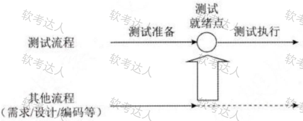

**敏捷测试模型：** 敏捷测试源于敏捷开发。敏捷测试是敏捷开发的组成部分，需要与开发流程良好融合，其特征如图所示。

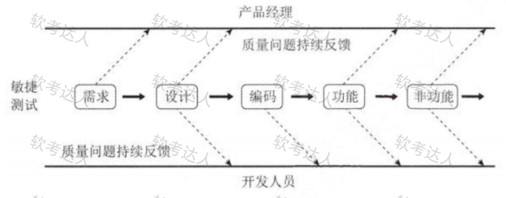

敏捷测试在整个敏捷开发过程中，需要与项目的其他人员甚至用户保持紧密协作，时刻关注需求变化并实施测试，以体现测试的时效性和适应性，这对测试人员有比较高的能力要求。

### 10.4.4 测试用例设计

**黑盒测试用例：** 将程序看做一个黑盒子，只知道输入输出，不知道内部代码，由此设计出测试用例，分为下面几类：  
(1)等价类划分：把所有的数据按照某种特性进行归类，而后在每类的数据里选取一个即可。等价类测试用例的设计原则：设计一个新的测试用例，使其尽可能多地覆盖尚未被覆盖的有效等价类，重复这一步，直到所有的有效等价类都被覆盖为止；计一个新的测试用例，使其仅覆盖一个尚未被覆盖的无效等价类，重复这一步，直到所有的无效等价类都被覆盖为止。  
(2)边界值划分：将每类的边界值作为测试用例，边界值一般为范围的两端值以及在此范围之外的与此范围间隔最小的两个值，如年龄范围为0-150,边界值为0,150,-1,151四个。  
(3)错误推测：没有固定的方法，凭经验而言，来推测有可能产生问题的地方，作为测试用例进行测试。  
(4)因果图：由一个结果来反推原因的方法，具体结果具体分析，没有固定方法。

**白盒测试用例：** 知道程序的代码逻辑，按照程序的代码语句，来设计覆盖代码分支的测试用例，覆盖级别从低至高分为下面几种：

(1)语句覆盖SC:逻辑代码中的所有语句都要被执行一遍，覆盖层级最低，因为执行了所有的

语句，不代表执行了所有的条件判断。

(2)判定覆盖DC:逻辑代码中的所有判断语句的条件的真假分支都要覆盖一次。

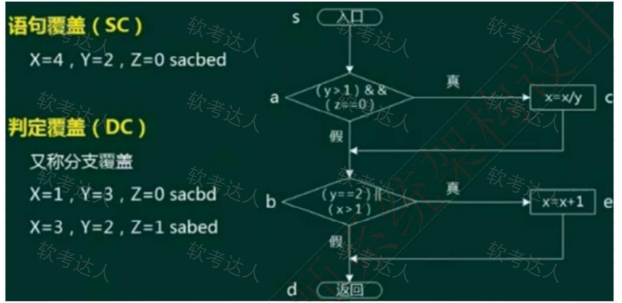

(3)条件覆盖CC:针对每一个判断条件内的每一个独立条件都要执行一遍真和假。

(4)条件判定组合覆盖CDC:同时满足判定覆盖和条件覆盖。

### 10.4.5 调试

测试是发现错误，调试是找出错误的代码和原因。

调试需要确定错误的准确位置；确定问题的原因并设法改正；改正后要进行回归测试。

**调试的方法:**  
(1)蛮力法：又称为穷举法或枚举法，穷举出所有可能的方法一一尝试。  
(2)回溯法：又称为试探法，按选优条件向前搜索，以达到目标，当发现原先选择并不优或达不到目标，就退回一步重新选择，这种走不通就退回再走的技术为回溯法。  
(3)演绎法：是由一般到特殊的推理方法，与“归纳法”相反，从一般性的前提出发。得出具体陈述或个别结论的过程。  
(4)归纳法：是由特殊到一般的推理方法，从测试所暴露的问题出发，收集所有正确或不正确的数据，分析它们之间的关系，提出假想的错误原因，用这些数据来证明或反驳，从而查出错误所在。

**软件度量中软件的两种属性：** 外部属性指面向管理者和用户的属性，可直接测量，一般为性能指标。内部属性指软件产品本身的的属性，如可靠性等，只能间接测量。

**McCabe度量法：** 又称为环路复杂度，假设有向图中有向边数为m,节点数为n,则此有向图的环路复杂度为m-n+2。注意m和n代表的含义不能混淆，可以用一个最简单的环路来做特殊值记忆此公式，另外，针对一个程序流程图，每一个分支边(连线)就是一条有向边，每一条语句(语句框)就是一个顶点。  
此外，推荐使用另一种简单的计算公式：环路复杂度=判定节点个数+1。

## 10.5 系统运行与维护

### 10.5.1 系统转换

**遗留系统：** 是指任何基本上不能进行修改和演化以满足新的变化了的业务需求的信息系统，它通常具有以下特点：

(1)系统虽然完成企业中许多重要的业务管理工作，但仍然不能完全满足要求。一般实现业务处理电子化及部分企业管理功能，很少涉及经营决策。

(2)系统在性能上已经落后，采用的技术已经过时。例如，多采用主机/终端形式或小型机系统，软件使用汇编语言或第三代程序设计语言的早期版本开发，使用文件系统而不是数据库。

(3)通常是大型的软件系统，已经融入企业的业务运作和决策管理机制之中，维护工作十分困难。

(4)没有使用现代信息系统建设方法进行管理和开发，现在基本上已经没有文档，很难理解。

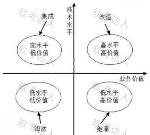

**系统转换是指新系统开发完毕，投入运行，取代现有系统的过程，需要考虑多方面的问题，以实**  现与老系统的交接，有以下三种转换计划：  
(1)直接转换：现有系统被新系统直接取代了，风险很大，适用于新系统不复杂，或者现有系统已经不能使用的情况。优点是节省成本。  
(2)并行转换：新系统和老系统并行工作一段时间，新系统经过试运行后再取代，若新系统在试运行过程中有问题，也不影响现有系统的运行，风险极小，在试运行过程中还可以比较新老系统的性能，适用于大型系统。缺点是耗费人力和时间资源，难以控制两个系统间的数据转换。  
(3)分段转换：分期分批逐步转换，是直接和并行转换的集合，将大型系统分为多个子系统，依次试运行每个子系统，成熟一个子系统，就转换一个子系统。同样适用于大型项目，只是更耗时，而且现有系统和新系统间混合使用，需要协调好接口等问题。

**数据转换与迁移：** 将数据从旧数据库迁移到新数据库中。要在新系统中尽可能的保存旧系统中合理的数据结构，才能降低迁移的难度。也有三种方法：系统切换前通过工具迁移、系统切换前采用手工录入、系统切换后通过新系统生成。

### 10.5.2 系统维护概述

**系统的可维护性：** 可以定义为维护人员理解、改正、改动和改进这个软件的难易程度，其评价指标  
如下：  
(1)易分析性。软件产品诊断软件中的缺陷或失效原因或识别待修改部分的能力。  
(2)易改变性。软件产品使指定的修改可以被实现的能力，实现包括编码、设计和文档的更改。  
(3)稳定性。软件产品避免由于软件修改而造成意外结果的能力。  
(4)易测试性。软件产品使已修改软件能被确认的能力。  
(5)维护性的依从性。软件产品遵循与维护性相关的标准或约定的能力。

**系统维护:包括硬件维护、软件维护和数据维护，其中软件维护类型如下：**

(1)正确性维护：发现了bug而进行的修改。

(2)适应性维护：由于外部环境发生了改变，被动进行的对软件的修改和升级。

(3)完善性维护：基于用户主动对软件提出更多的需求，修改软件，增加更多的功能，使其比之前的软件功能、性能更高，更加完善。

(4)预防性维护：对未来可能发生的bug进行预防性的修改。

## 10.6 净室软件工程

**净室软件工程**是一种应用数学与统计学理论以经济的方式生产高质量软件的工程技术，力图通过严格的工程化的软件过程达到开发中的零缺陷或接近零缺陷。净室方法不是先制作一个产品，再去消除缺陷，而是要求在**规约和设计中消除错误**，然后以“净”的方式制作，可以降低软件开发中的风险，以合理的成本开发出高质量的软件。

**在净室软件工程背后的哲学是：** 通过在第1次正确地书写代码增量，并在测试前验证它们的正确性，来避免对成本很高的错误消除过程的依赖。它的过程模型是在代码增量积聚到系统的过程的同时，进行代码增量的统计质量验证。它甚至提倡开发者不需要进行单元测试，而是进行正确性验证和统计质量控制。

**净室软件工程(CSE)的理论基础：** 主要是函数理论和抽样理论。

**净室软件工程应用技术手段：**  
1.统计过程控制下的增量式开发。  
2.基于函数的规范与设计。  
3.正确性验证。CSE的核心。  
4.统计测试和软件认证。

**净室软件工程在使用过程的一些缺点：**  
(1)CSE太理论化，需要更多的数学知识。其正确性验证的步骤比较困难且比较耗时。  
(2)CSE开发小组不进行传统的模块测试，这是不现实的。  
(3)CSE也会带有传统软件工程的一些弊端。

## 10.7 基于构件的软件工程

**基于构件的软件工程(CBSE)：** 是一种基于分布对象技术、强调通过可复用构件设计与构造软件系统的软件复用途径。CBSE体现了“购买而不是重新构造”的哲学，将软件开发的重点从程序编写转移到了基于己有构件的组装，以更快地构造系统，减轻用来支持和升级大型系统所需要的维护负担，从而降低软件开发的费用。

**用于CBSE的构件应该具备以下特征：**

(1)可组装型：对于可组装的构件，所有外部交互必须通过公开定义的接口进行。同时它还必须对自身信息的外部访问。

(2)可部署性：软件必须是自包含的，必须能作为一个独立实体在提供其构件模型实现的构件平台上运行。构件总是二进制形式，无须在部署前编译。

(3)文档化：构件必须是完全文档化的，用户根据文档来判断构件是否满足需求。

(4)独立性：构件应该是独立的，应该可以在无其他特殊构件的情况下进行组装和部署，如确实需要其他构件提供服务，则应显示声明。

(5)标准化：构件标准化意味着在CBSE过程中使用的构件必须符合某种标准化的构件模型。

**构件模型：** 定义了构件实现、文档化以及开发的标准，其包含的模型要素为：  
(1)接口。构件通过构件接口来定义，构件模型规定应如何定义构件接口以及在接口定义中应该包含的要素，如操作名、参数以及异常等。  
(2)使用信息。为使构件远程分布和访问，必须给构件一个特定的、全局唯一的名字或句柄。构件元数据是构件本身相关的数据，比如构件的接口和属性信息。  
(3)部署。构件模型包括一个规格说明，指出应该如何打包构件使其部署成为一个独立的可执行实体。部署信息中包含有关包中内容的信息和它的二进制构成的信息。

**构件模型提供了一组被构件使用的通用服务，这种服务包括以下两种。**  
·平台服务，允许构件在分布式环境下通信和互操作。  
·支持服务，这是很多构件需要的共性服务。例如，构件都需要的身份认证服务。  
中间件实现共性的构件服务，并提供这些服务的接口。

基于构件的开发模型利用模块化方法将整个系统模块化，并在一定构件模型的支持下复用构件库中的一个或多个软件构件，通过组合手段髙效率、髙质量地构造应用软件系统的过程。基于构件的开发模型融合了螺旋模型的许多特征，本质上是演化形的，开发过程是迭代的。基于构件的开发模型由软件的需求分析定义、体系结构设计、构件库建立、应用软件构建以及测试和发布5个阶段组成。

**CBSE过程：** 是支持基于构件组装的软件开发过程，过程中的6个主要活动：系统需求概览、识别候选构件、根据发现的构件修改需求、体系结构设计、构件定制与适配、组装构件创建系统。

**CBSE过程与传统软件开发过程不同点：**

(1)CBSE早期需要完整的需求，以便尽可能多地识别出可复用的构件。

(2)在过程早期阶段根据可利用的构件来细化和修改需求。如果可利用的构件不能满足用户需求，就应该考虑由复用构件支持的相关需求。

(3)在系统体系结构设计完成后，会有一个进一步的对构件搜索及设计精化的活动。可能需要为某些构件寻找备用构件，或者修改构件以适合功能和架构的要求。

(4)开发就是将己经找到的构件集成在一起的组装过程。

**构件组装：** 是指构件相互直接集成或是用专门编写的“胶水代码”将它们整合在一起来创造一个系统或另一个构件的过程。

**常见的组装构件有以下3种组装方式。**

1.顺序组装。通过按顺序调用己经存在的构件，可以用两个已经存在的构件来创造一个新的构件。如上一个构件输出作为下一个构件的输入。

2.层次组装。这种情况发生在一个构件直接调用自另一个构件所提供的服务时。被调用的构件为调用的构件提供所需的服务。二者之间接口匹配兼容。

3.叠加组装。这种情况发生在两个或两个以上构件放在一起来创建一个新构件的时候。这个新构件合并了原构件的功能，从而对外提供了新的接口。外部应用可以通过新接口来调用原有构件的接口，而原有构件不互相依赖，也不互相调用。这种组装类型适合于构件是程序单元或者构件是服务的情况。

**构件组装的三种不兼容问题(通过编写适配器解决):**  
(1)参数不兼容。接口每一侧的操作有相同的名字，但参数类型或参数个数不相同。  
(2)操作不兼容。提供接口和请求接口的操作名不同。  
(3)操作不完备。一个构件的提供接口是另一个构件请求接口的一个子集，或者相反。

# 11. 面向对象技术

## 11.1 面向对象基础

### 11.1.1 面向对象的基本概念

**对象：** 由数据及其操作所构成的封装体，是系统中用来描述客观事务的一个实体，是构成系统的一个基本单位。一个对象通常可以由对象名、属性和方法3个部分组成。

**类：** 现实世界中实体的形式化描述，类将该实体的属性(数据)和操作(函数)封装在一起。对象是类的实例，类是对象的模板。

类可以分为三种：实体类、接口类(边界类)和控制类。实体类的对象表示现实世界中真实的实体，如人、物等。接口类(边界类)的对象为用户提供一种与系统合作交互的方式，分为人和系统两大类，其中人的接口可以是显示屏、窗口、Web窗体、对话框、菜单、列表框、其他显示控制、条形码、二维码或者用户与系统交互的其他方法。系统接口涉及到把数据发送到其他系统，或者从其他系统接收数据。控制类的对象用来控制活动流，充当协调者。

**抽象：** 通过特定的实例抽取共同特征以后形成概念的过程。它强调主要特征，忽略次要特征。一个对象是现实世界中一个实体的抽象，一个类是一组对象的抽象，抽象是一种单一化的描述，它强调给出与应用相关的特性，抛弃不相关的特性。

**封装：** 是一种信息隐蔽技术，将相关的概念组成一个单元模块，并通过一个名称来引用。面向对象封装是将数据和基于数据的操作封装成一个整体对象，对数据的访问或修改只能通过对象对外提供的接口进行。

**继承：** 表示类之间的层次关系(父类与子类),这种关系使得某类对象可以继承另外一类对象的特征，又可分为单继承和多继承。

**多态：** 不同的对象收到同一个消息时产生完全不同的结果。包括参数多态(不同类型参数多种结构类型)、包含多态(父子类型关系)、过载多态(类似于重载，一个名字不同含义)、强制多态(强制类型转换)四种类型。多态由继承机制支持，将通用消息放在抽象层，具体不同的功能实现放在低层。

**接口：** 描述对操作规范的说明，其只说明操作应该做什么,并没有定义操作如何做。

**消息：** 体现对象间的交互，通过它向目标对象发送操作请求。

**覆盖：** 子类在原有父类接口的基础上，用适合于自己要求的实现去置换父类中的相应实现。即在子类中重定义一个与父类同名同参的方法。

**函数重载：** 与覆盖要区分开，函数重载与子类父类无关，且函数是同名不同参数。

**绑定：** 是一个把过程调用和响应调用所需要执行的代码加以结合的过程。在一般的程序设计语言中，绑定是在编译时进行的，叫作静态绑定。动态绑定则是在运行时进行的，因此，一个给定的过程调用和代码的结合直到调用发生时才进行。

**面向对象的分析：** 是为了确定问题域，理解问题。包含五个活动：认定对象、组织对象、描述对象间的相互作用、确定对象的操作、定义对象的内部信息。

**面向对象需求建模：** 

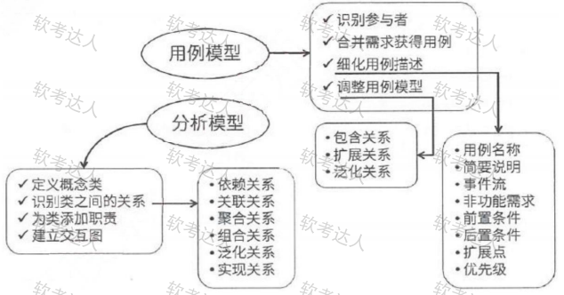

**面向对象的设计：** 是设计分析模型和实现相应源代码，设计问题域的解决方案，与技术相关。OOD同样应遵循抽象、信息隐蔽、功能独立、模块化等设计准则。

**面向对象的分析模型主要由**顶层架构图 **、**用例与用例图**、**领域概念模型**构成；设计模型则包含以包图表示的软件体系结构图、以交互图表示的用例实现图、完整精确的类图、针对复杂对象的状态图** 和用以描述流程化处理过程的活动图等。

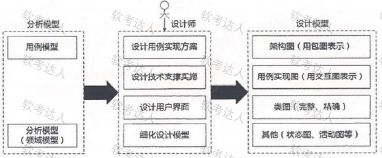

**面向对象的设计原则（面向对象方法中的五大原则）：**  
(1)单一责任原则。就一个类而言，应该仅有一个引起它变化的原因。即，当需要修改某个类的时候原因有且只有一个，让一个类只做一种类型责任。  
(2)开放一封闭原则。软件实体(类、模块、函数等)应该是可以扩展的，即开放的；但是不可修改的，即封闭的。  
(3)里氏替换原则。子类型必须能够替换掉他们的基类型。即，在任何父类可以出现的地方，都可以用子类的实例来赋值给父类型的引用。  
(4)依赖倒置原则。抽象不应该依赖于细节，细节应该依赖于抽象。即，高层模块不应该依赖于低层模块，二者都应该依赖于抽象。  
(5)接口分离原则。不应该强迫客户依赖于它们不用的方法。接口属于客户，不属于它所在的类层次结构。即：依赖于抽象，不要依赖于具体，同时在抽象级别不应该有对于细节的依赖。这样做 的好处就在于可以最大限度地应对可能的变化。

**除了面向对象方法中的五大原则之外，RobertC.Martin提出的面向对象设计原则还包括以下几个：**  
(1)重用发布等价原则。重用的粒度就是发布的粒度。  
(2)共同封闭原则。包中的所有类对于同一类性质的变化应该是共同封闭的。一个变化若对一个包产生影响，则将对该包中的所有类产生影响，而对于其他的包不造成任何影响。  
(3)共同重用原则。一个包中的所有类应该是共同重用的。如果重用了包中的一个类，那么就要重用包中的所有类。  
(4)无环依赖原则。在包的依赖关系图中不允许存在环，即包之间的结构必须是一个直接的五环图形。  
(5)稳定依赖原则。朝着稳定的方向进行依赖。  
(6)稳定抽象原则。包的抽象程度应该和其稳定程度一致。

**面向对象的测试：**  
一般来说，对面向对象软件的测试可分为下列4个层次进行。  
(1)算法层。测试类中定义的每个方法，基本上相当于传统软件测试中的单元测试。  
(2)类层。测试封装在同一个类中的所有方法与属性之间的相互作用。在向面对象软件中类是基本模块，因此可以认为这是面向对象测试中所特有的模块测试。  
(3)模板层。测试一组协同工作的类之间的相互作用，大体上相当于传统软件测试中的集成测试，但是也有面向对象软件的特点(例如，对象之间通过发送消息相互作用)。  
(4)系统层。把各个子系统组装成完整的面向对象软件系统，在组装过程中同时进行测试。

## 11.2 UML

### 11.2.1 UML概念

**UML(统一建模语言)：** 是一种可视化的建模语言，而非程序设计语言，支持从需求分析开始的软件开发的全过程。

**从总体上来看，UML的结构包括**构造块**、**规则**和**公共机制**三个部分。**

(1)构造块。UML有三种基本的构造块，分别是事物(thing)、关系(relationship)和图(diagram)。事物是UML的重要组成部分，关系把事物紧密联系在一起，图是多个相互关联的事物的集合。

(2)公共机制。公共机制是指达到特定目标的公共UML方法。

(3)规则。规则是构造块如何放在一起的规定。

### 11.2.2 事物

**结构事物：** 模型的静态部分，如类、接口、用例、构件等；

**行为事物：** 模型的动态部分，如交互、活动、状态机；

**分组事物：** 模型的组织部分，如包；

**注释事物：** 模型的解释部分，依附于一个元素或一组元素之上对其进行约束或解释的简单符号。

### 11.2.3 关系

**依赖：** 一个事物的语义依赖于另一个事物的语义的变化而变化。

**关联：** 是一种结构关系，描述了一组链，链是对象之间的连接。分为组合和聚合，都是部分和整体的关系，其中组合事物之间关系更强。两个类之间的关联，实际上是两个类所扮演角色的关联，因此，两个类之间可以有多个由不同角色标识的关联。

**泛化：** 一般/特殊的关系，子类和父类之间的关系

**实现：** 一个类元指定了另一个类元保证执行的契约。

关系UML图形代号如下：

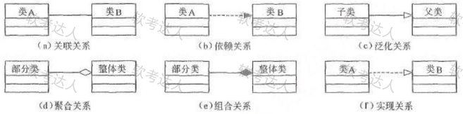

### 11.2.4 图

UML2.0图，书上是13种，实际还包含制品图，一共14种，了解即可，总分类如下：

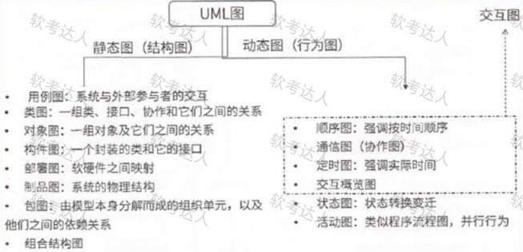

**类图：静态图**，为系统的静态设计视图，展现一组对象、接口、协作和它们之间的关系。UML类图如下：

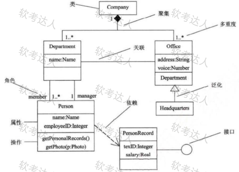

**对象图：静态图**，展现某一时刻一组对象及它们之间的关系，为类图的某一快照。在没有类图的前提下，对象图就是静态设计视图。如下：

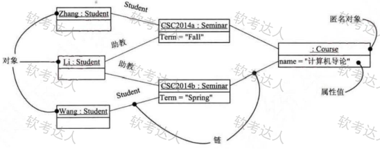

**用例图：静态图**，展现了一组用例、参与者以及它们之、间的关系。用例图中的参与者是人、硬件或其他系统可以扮演的角色；用例是参与者完成的一系列操作，用例之间的关系有扩展、包含、泛化。如下：

用例是在系统中执行的一系列动作，这些动作将生成特定参与者可见的价值结果。它确定了一个和系统参与者进行交互，并可由系统执行的动作序列。用例模型描述的是外部执行者（Actor）所理解的系统功能。用例模型用于需求分析阶段，它的建立是系统开发者和用户反复讨论的结果，表明了开发者和用户对需求规格达成的共识。

两个用例之间的关系主要有两种情况：一种是用于重用的包含关系，用构造型 include表示；另一种是用于分离出不同行为的扩展，用构造型extend表示。

①包含关系：当可以从两个或两个以上的原始用例中提取公共行为，或者发现能 够使用一个构件来实现某一个用例的部分功能是很重要的事时，应该使用包含关系来表示它们。

②扩展关系：如果一个用例明显地混合了两种或两种以上的不同场景，即根据情况可能发生多种事情，可以断定将这个用例分为一个主用例和一个或多个辅用例描述可能更加清晰。

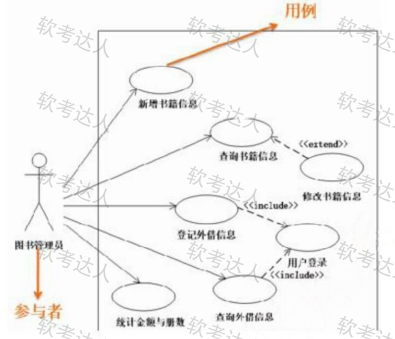

**序列图：即顺序图，动态图**，是场景的图形化表示，描述了以时间顺序组织的对象之间的交互活动。有同步消息(进行阻塞调用，调用者中止执行，等待控制权返回，需要等待返回消息，用实心三角箭头表示),异步消息(发出消息后继续执行，不引起调用者阻塞，也不等待返回消息，由空心箭头表示)、返回消息(由从右到左的虚线箭头表示)三种。如下：

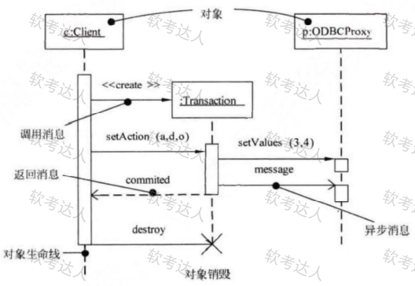

**通信图：动态图，即协作图**，强调参加交互的对象的组织。如下：
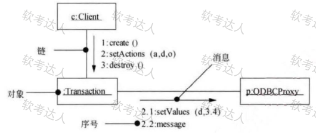

**状态图：动态图，展现了一个状态机**，描述单个对象在多个用例中的行为，包括简单状态和组合状态。转换可以通过事件触发器触发，事件触发后相应的监护条件会进行检查。状态图中转换和状态是两个独立的概念，如下：图中方框代表状态，箭头上的代表触发事件，实心圆点为起点和终点。
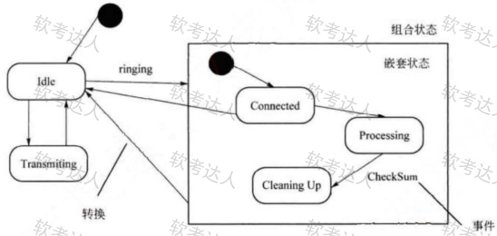

**活动图：动态图，是一种特殊的状态图**，展现了在系统内从一个活动到另一个活动的流程。活动的分岔和汇合线是一条水平粗线。牢记下图中并发分岔、并发汇合、监护表达式、分支、流等名词及含义。每个分岔的分支数代表了可同时运行的线程数。活动图中能够并行执行的是在一个分岔粗线下的分支上的活动，如下：
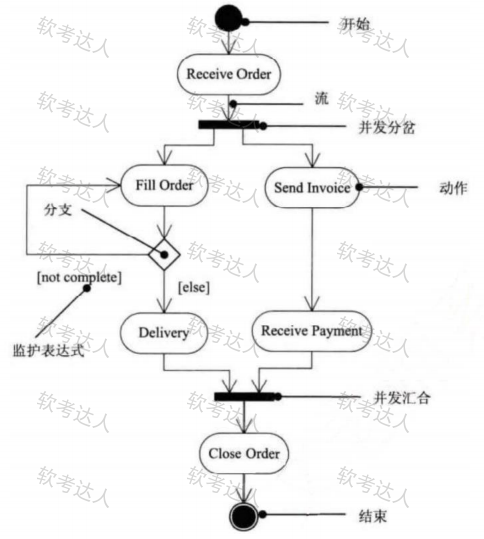

**构件图(组件图)：静态图**，为系统静态实现视图，展现了一组构件之间的组织和依赖。如下：

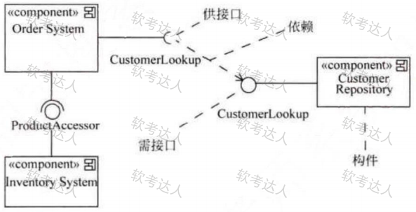

**部署图：静态图**，为系统静态部署视图，部署图物理模块的节点分布。它与构件图相关，通常一个结点包含一个或多个构件。其依赖关系类似于包依赖，因此部署组件之间的依赖是单向的类似于包含关系。如下：

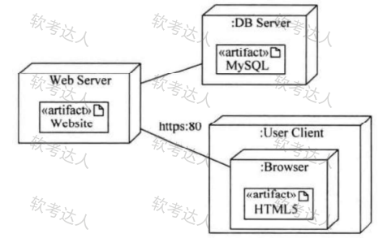

UML5种视图,如下图所示：
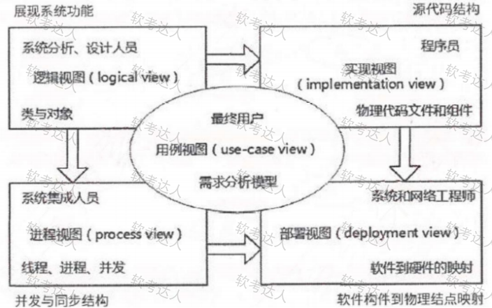

**并发与同步结构软件构件到物理结点映射:**

(1)逻辑视图。逻辑视图也称为设计视图，它表示了设计模型中在架构方面具有重要意义的部分，即类、子系统、包和用例实现的子集。

(2)进程视图。进程视图是可执行线程和进程作为活动类的建模，它是逻辑视图的一次执行实例，描述了并发与同步结构。

(3)实现视图。实现视图对组成基于系统的物理代码的文件和构件进行建模。

(4)部署视图。部署视图把构件部署到一组物理节点上，表示软件到硬件的映射和分布结构。

(5)用例视图。用例视图是最基本的需求分析模型。

## 11.3 SysML

**SysML是一种通用图形建模语言，用于指定，分析，设计和验证可能包括硬件，软件，信息，人员，程序和设施的复杂系统。特别是，该语言提供了图形表示，其具有用于建模系统需求，行为，结**  构和参数的语义基础，用于与其他工程分析模型集成。

**系统建模语言(SysML)：** 已成为基于模型的系统工程(MBSE)应用程序的事实上的标准系统架构建模语言。SysML是UML2的一种方言，它扩展了软件密集型应用程序的统一建模语言(UML)标准，使其可以成功应用于系统工程应用程序。

**基于模型的系统工程(MBSE):** 又称基于模型的系统开发(MBSD),是一种系统工程过程范例，强调严格的体系结构建模原则和最佳实践应用于整个系统开发生命周期(SDLC)中的系统工程活动。这些系统工程活动包括但不限于需求分析，功能分析，性能分析，系统设计，贸易研究，系统架构规范以及系统验证和验证。

**与UML相比，SysML为系统工程师提供了以下优于指定系统的优势：**

（1）SysML比UML更好地表达系统工程语义(符号解释)。它减少了UML的软件偏差，并为需求管理和性能分析添加了两种新的图表类型：需求图和参数图。

（2）SysML比UML更小，更容易学习。由于SysML删除了许多以软件为中心和无偿的构造，因此在图表类型(9对13)和总结构中测量的整体语言较小。

（3）SysML模型管理构造支持模型，视图和视点的规范，这些规范在架构上与IEEE-Std-1471-2000(IEEE推荐的软件密集型系统架构描述实践)保持一致。

（4）SysML和UML间存在交集，即SysML语言中的部分图是和UML中的相应图是一致的，例如用例图。同时，SysML也有基于UML扩展而来的图，例如活动图。另外，还有一部分图是SysML所特有的，这些图与UML间没有关系，例如需求图。

**SysML提供了9种图来支持用户进行系统建模。**
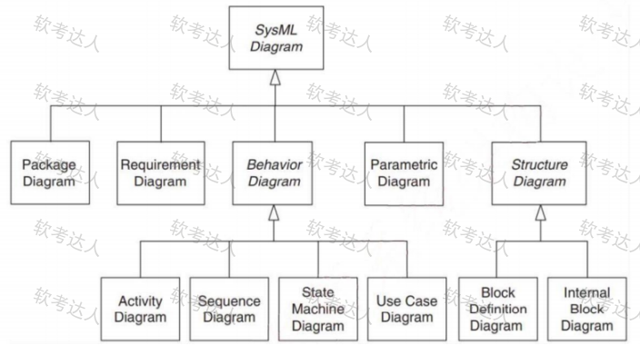

SysML规定了七个需求关系:

1)复合关系:复合需求可以包含需求层次结构中的子需求。复合需求可以声明系统应执行A和B,可以将其分解为系统应执行A和系统应进行B的子需求。
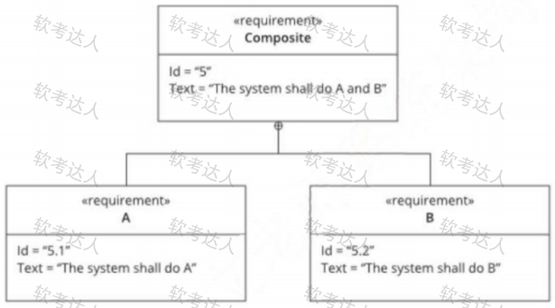

2)派生关系：派生的需求通常对应于系统层次结构下一级的需求。一个简单的例子是车辆加速需求，该需求被分析以导出发动机动力等方面的需求

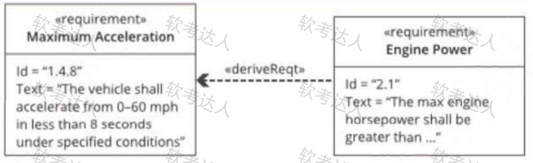

3)细化关系：细化关系可用于描述如何使用模型元素或元素集进一步细化需求。例如，可以使用用例或活动图来细化基于文本的功能需求

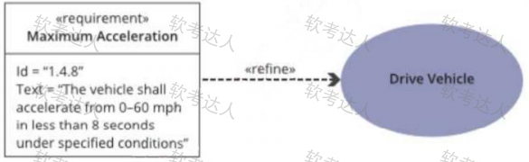

4)满足关系：满足关系描述了设计或实现模型如何满足一个或多个需求。然后，系统建模者可以指定旨在满足要求的系统设计元素

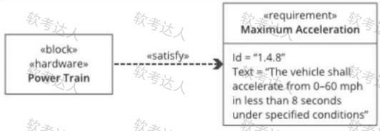

5)验证关系：验证关系定义了测试用例或其他模型元素如何验证需求。在SysML中，测试用例或其他元素可以用作表示任何标准检验方法的通用机制，分析，演示或测试。

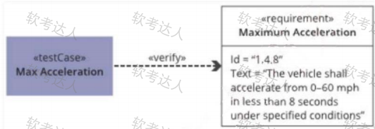

6)复制关系：真正需要跨产品系列和项目重用需求。典型的方案是适用于产品和/或产品系列中重复使用的项目和要求的法定法规或合同要求。

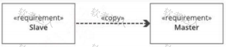

7)追溯关系：追溯关系提供了需求和任何其他模型元素之间的通用关系。追溯关系对于将需求与源文档相关联或在规范树中的规范之间建立关系可能很有用

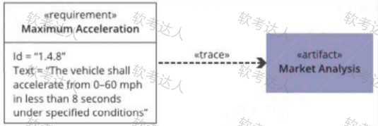

**模块定义图BDD和内部模块图IBD**

创建IBD是为了指定**单个模块**的内部结构。和BDD—样，IBD是系统或者系统一个组成部分的静态(结构化)视图。和BDD不同的是，IBD不会显示模块，它会显示对模块的使用——也就是在IBD头部命名的模块的组成部分属性和引用属性。

在BDD中也可以显示组成部分属性和引用属性——或者是作为模块分隔框中的字符串，或者是作为关联一端的角色名称。但是IBD可以表达在BDD中无法表达的信息：组成部分属性和引用属性之间的连接；在连接之间流动的事件、能量和数据的类型；以及通过连接提供和请求的服务。

IBD会表达模块的组成部分必须如何组合才能够创建有效实例。它还会显示模块的实例必须如何与外部实体(引用属性)连接，以在整体上创建系统的有效实例。
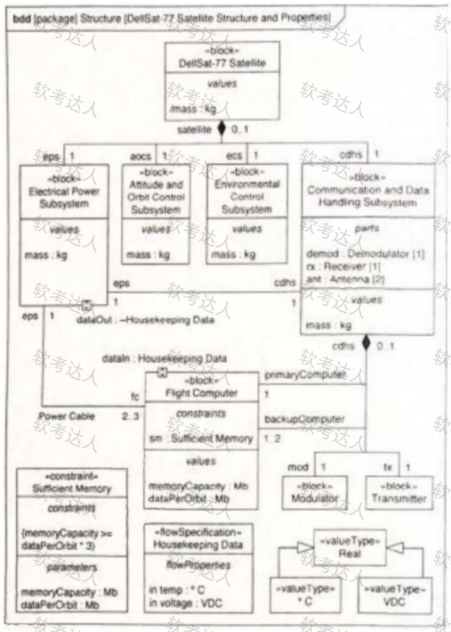

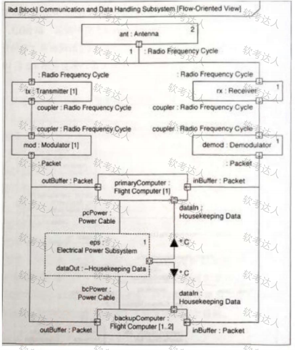

**参数图**:SysML参数图是一种特殊的内部块图。和IBD一样，参数图会显示模块的内部结构，但是其关注点在于值属性和约束参数之间的绑定关系。因此，可以说，参数图和块定义图提供了模块的互补视图。

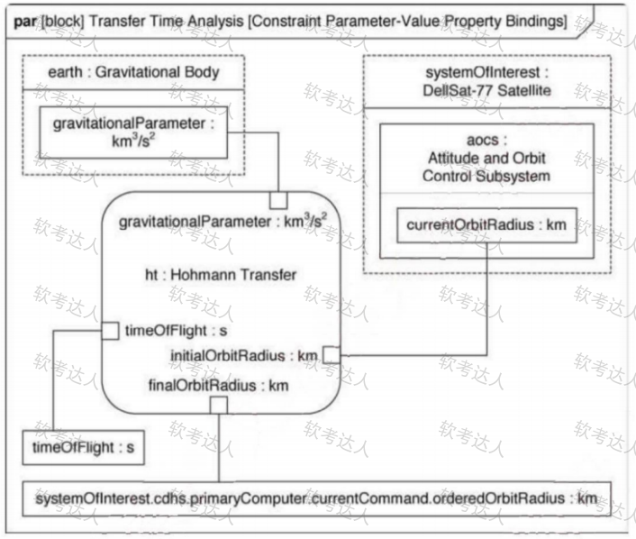

# 13. 系统架构设计

## 13.1. 软件架构的概念

**一个程序和计算系统软件体系结构是指系统的一个或者多个结构。结构中包括**软件的构件，构件的外部可见属性以及它们之间的相互关系。

**体系结构并非可运行软件。确切地说，它是一种表达，使软件工程师能够：**  
(1)分析设计在满足所规定的需求方面的有效性：  
(2)在设计变更相对容易的阶段，考虑体系结构可能的选择方案；  
(3)降低与软件构造相关联的风险。

软件构件简单到可以是**程序模块或者面向对象的类**，也可以扩充到包含**数据库**和**能够完成客户与服务器网络配置的“中间件”**。

**软件体系结构的设计两个层次**  数据设计和体系结构设计。**数据设计**体现传统系统中体系结构的数据构件和面向对象系统中类的定义(封装了属性和操作),**体系结构**设计则主要关注软件构件的**结构、属性和交互作用**。

架构设计是一个迭代过程，在建立软件架构的初期，选择一个合适的架构风格是首要的，在此基础上，开发人员通过架构模型，可以获得关于软件架构属性的理解，为将来的架构实现与演化过程建立了目标。

**软件架构设计与生命周期**

1.需求分析阶段。需求分析和SA设计面临的是不同的对象：一个是问题空间；另一个是解空间。从软件需求模型向SA模型的转换主要关注两个问题：如何根据需求模型构建SA模型。如何保证模型转换的可追踪性。

2.设计阶段。是SA研究关注的最早和最多的阶段，这一阶段的SA研究主要包括：SA模型的描述、SA模型的设计与分析方法，以及对SA设计经验的总结与复用等。有关SA模型描述的研究分为3个层次：SA的基本概念(构件和连接子)、体系结构描述语言ADL、SA模型的多视图表示。

3.实现阶段。最初SA研究往往只关注较高层次的系统设计、描述和验证。为了有效实现SA设计向实现的转换，实现阶段的体系结构研究表现在以下几个方面。

(1)研究基于SA的开发过程支持，如项目组织结构、配置管理等。

(2)寻求从SA向实现过渡的途径，如将程序设计语言元素引入SA阶段、模型映射、构件组装、复用中间件平台等。

(3)研究基于SA的测试技术。

4.构件组装阶段。在SA设计模型的指导下，可复用构件的组装可以在较高层次上实现系统，并能够提高系统实现的效率。在构件组装的过程中，SA设计模型起到了系统蓝图的作用。研究内容包括如下两个方面。

(1)如何支持可复用构件的互联，即对SA设计模型中规约的连接子的实现提供支持。

(2)在组装过程中，如何检测并消除体系结构失配问题。

在构件组装阶段的失配问题主要包括：由构件引起的失配、由连接子引起的失配、由于系统成分对全局体系结构的假设存在冲突引起的失配等。

5.部署阶段。SA对软件部署作用如下。

(1)提供高层的体系结构视图来描述部署阶段的软硬件模型。

(2)基于SA模型可以分析部署方案的质量属性，从而选择合理的部署方案。

6.后开发阶段。是指软件部署安装之后的阶段。这一阶段的SA研究主要围绕维护、演化、复用等方面来进行。典型的研究方向包括动态软件体系结构、体系结构恢复与重建等。

(1)动态软件体系结构。现实中的软件具有动态性，体系结构会在运行时发生改变。

运行时变化包括两类：软件内部执行所导致的体系结构改变；软件系统外部的请求对软件进行的重配置。

包括两个部分的研究：体系结构设计阶段的支持、运行时刻基础设施的支持。

(2)体系结构恢复与重建。对于现有系统在开发时候没有考虑SA的情况，从这些系统中恢复或重购体系结构。从已有的系统中获取体系结构的重建方法分为4类：手工体系结构重建、工具支持的手工重建、通过查询语言来自动建立聚集、使用其他技术(如数据挖掘等)。

**架构设计概述:**从需求分析到软件设计之间的过渡过程称为软件架构。只要软件架构设计好了，整个软件就不会出现坍塌性的错误，即不会崩溃。

架构设计就是需求分配，将满足需求的职责分配到组件上。

**软件架构为软件系统提供了一个**  **结构**、**行为**和**属性**的高级抽象，由构件的**描述**、构件的相互作用 (连接件)、指导构件集成的模式以及这些模式的约束组成。

架构模式是软件设计中的高层决策，例如C/S结构就属于架构模式，架构模式反映了开发软件系统过程中所作的基本设计决策；设计模式主要关注软件系统的设计，与具体的实现语言无关；惯用法则是实现时通过某种特定的程序设计语言来描述构件与构件之间的关系，例如引用-计数就是C++语言中的一种惯用法。

**软件架构不仅指定了**系统的组织结构**和**拓扑结构 **，并且显示了系统需求和构件之间的对应关系，** 提供了一些设计决策的基本原理。

**软件系统架构**是关于软件系统的结构、行为和属性的高级抽象。在描述阶段，主要描述直接构成系统的抽象组件以及各个组件之间的连接规则，特别是相对细致地描述组件的交互关系。在实现阶段，这些抽象组件被细化为实际的组件，比如具体类或者对象。软件系统架构不仅指定了软件系统的组织和拓扑结构，而且显示了系统需求和组件之间的对应关系，包括设计决策的基本方法和基本原理。

解决好软件的复用、质量和维护问题，是研究软件架构的根本目的。

**软件架构设计包括提出**架构模型 **，**产生架构设计**和**进行设计评审**等活动，是一个迭代的过程。架** 构设计主要关注软件组件的结构、属性和交互作用，并通过多种视图全面描述特定系统的架构。

**架构设计作用:** 软件架构能够在设计变更相对容易的阶段，考虑系统结构的可选方案，便于技术人员与非技术人员就软件设计进行交互，能够展现软件的结构、属性与内部交互关系。

软件架构是**项目干系人**进行交流的手段，明确了对系统实现的约束条件，决定了开发和维护组织的组织结构，制约着系统的质量属性。

软件架构使推理和控制的更改更加简单，有助于循序渐进的原型设计，可以作为培训的基础。

软件架构是可传递和可复用的模型，通过研究软件架构可能预测软件的质量。

构件是一个独立可交付的功能单元，外界通过接口访问其提供的服务。

**构件由一组通常需要**同时部署的原子**构件组成。一个原子构件是**一个模块**和**一组资源 **。原子构件** 是部署、版本控制和替换的基本单位。原子构件通常成组地部署，但是它也能够被单独部署。

 构件和原子构件之间的区别在于，**大多数原子构件永远都不会被单独部署**， 尽管它们可以被单独部署。相反，大多数原子构件都属于一个构件家族，一次部署往往涉及整个家族。

一个模块是不带单独资源的原子构件(在这个严格定义下，Java包不是模块——在Java中部署的原子单元是类文件。一个单独的包被编译成多个单独的类文件——每个公共类都有一个)。

模块是一组类和可能的非面向对象的结构体，比如过程或者函数。

**构件的特性是：**(1)独立部署单元；(2)作为第三方的组装单元；(3)没有(外部的)可见状态。一个构件可以包含多个类元素，但是一个类元素只能属于一个构件。将一个类拆分进行部署通常没什么意义。

**对象的特性是：**(1)一个实例单元，具有唯一的标志。(2)可能具有状态，此状态外部可见。(3)封装了自己的状态和行为。

**接口标准化是对接口中消息的格式、模式和协议的标准化。它不是要将接口格式化为参数化操作的集合，而是关注输入输出的消息的标准化，它强调当机器在网络中互连时，标准的消息模式、格**  式、协议的重要性。

**面向构件的编程(COP)：** 关注于如何支持建立面向构件的解决方案。“面向构件的编程需要下列基本的支持：  
——多态性(可替代性);  
——模块封装性(高层次信息的隐藏);  
——后期的绑定和装载(部署独立性);  
——安全性(类型和模块安全性)。”

在**ANSI/IEEE 1471-2000**标准中，系统是为了达成利益相关人（Stakeholder）的某些使命（Mission），在特定环境 （Enviroment）中构建的。每一个系统都有一个架构（Architecture）。架构是对所有利益相关人的关注点（Concern）的响应和回答，通过架构描述（Architecture Description）来 说明。每一个利益相关人都有各自的关注点。这些关注点是指对其重要的，与系统的开发、运营或其他方面相关的利益。架构描述（Architecture Description）本质上是多视图的。每一个视图（View）是从一个特定的视角（Viewpoint）来表述架构的某一个独立的方面。试图用一个单一的视图来覆盖所有的关注点当然是最好的，但实际上这种表述方式将很难理解。视角（Viewpoint）的选择，基于要解决哪些利益相关人的哪些关注点。它决定了用来创建视图的语言、符号和模型等，以及任何与创建视图相关的建模方法或者分析技术。一个视图（View）包括一个或者多个架构模型（Model），一个模型也可能参与多个视图。模型较文本的表述的好处在于，可以更容易的可视化、检查、分析、管理和集成。

## 13.2 基于架构的软件开发方法

ABSD方法是架构驱动，强调由业务、质量和功能需求的组合驱动架构设计。它强调采用**视角和视图**来描述软件架构，采用**用例和质量属性场景**来描述需求。进一步来说，**用例**描述的是功能需求，**质量属性场景**描述的是质量需求(或侧重于非功能需求)。

**使用ABSD方法，设计活动可以从项目总体功能框架明确就开始，这意味着需求获取和分析还没有完成，就开始了软件设计。**  
ABSD方法有三个基础。第一个基础是功能的分解，使用已有的基于模块的内聚和耦合技术；第二个基础是通过选择架构风格来实现质量和业务需求；第三个基础是软件模板的使用，软件模板利用了一些软件系统的结构。

**ABSD方法是**递归的**，且迭代的每一个步骤都是清晰定义的。因此，不管设计是否完成，架构总**是清晰的，有助于降低架构设计的随意性。

架构设计是在需求分析之后，概要设计之前，是为了解决需求分析和软件设计之间的鸿沟问题。

**基于架构的软件开发过程可分为下列六步：**

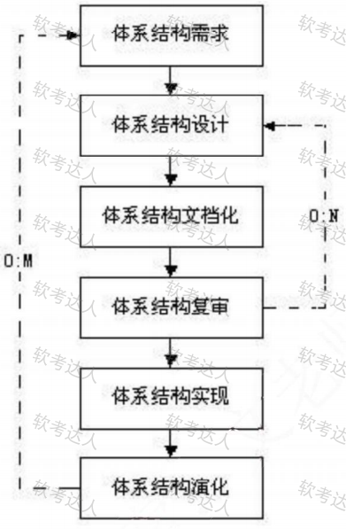

## 13.3. 软件架构风格

### 13.3.1. 软件体系结构风格

软件体系结构风格是描述某一特定应用领域中系统组织方式的惯用模式。架构风格定义一个系统家族，即一个架构定义一个词汇表和一组约束。词汇表中包含一些构件和连接件类型，而这组约束指出系统是如何将这些构件和连接件组合起来的。

架构风格反映了领域中众多系统所共有的**结构和语义**特性，并指导如何将各个模块和子系统有效地组织成一个完整的系统。对软件架构风格的研究和实践促进对设计的重用，一些经过实践证实的解决方案也可以可靠地用于解决新的问题。

架构设计的一个核心问题是能否达到架构级的软件复用。

架构风格定义了用于描述系统的术语表和一组指导构建系统的规则。

### 13.3.2. 基本架构风格

数据流风格：面向数据流，按照一定的顺序从前向后执行程序，代表的风格有批处理序列、管道-过滤器。

调用/返回风格：构件之间存在互相调用的关系，一般是显式的调用，代表的风格有主程序/子程序、面向对象、层次结构(C/S架构风格本质属于层次风格)。

独立构件风格：构件之间是互相独立的，不存在显式的调用关系，而是通过某个事件触发、异步的方式来执行，代表的风格有进程通信、事件驱动系统(隐式调用)。

虚拟机风格：自定义了一套规则供使用者使用，使用者基于这个规则来开发构件，能够跨平台适配，代表的风格有解释器、基于规则的系统。

仓库风格：以数据位中心，所有的操作都是围绕建立的数据中心进行的，代表的风格有数据库系统、超文本系统、黑板系统。
在仓库风格中，有两种不同的构件：中央数据结构说明当前状态，独立构件在中央数据存储上执行。

数据流风格,批处理序列：构件为一系列固定顺序的计算单元，构件之间只通过数据传递交互。每个处理步骤是一个独立的程序，每一步必须在其前一步结束后才能开始，数据必须是完整的，以整体的方式传递。

数据流风格,管道-过滤器：每个构件都有一组输入和输出，构件读取输入的数据流，经过内部处理，产生输出数据流。前一个构件的输出作为后一个构件的输入，前后数据流关联。过滤器就是构件，连接件就是管道。

主程序/子程序：单线程控制，把问题划分为若干个处理步骤，构件即为主程序和子程序，子程序通常可合成为模块。过程调用作为交互机制，充当连接件的角色。调用关系具有层次性，其语义逻辑表现为主程序的正确性取决于它调用的子程序的正确性。

面向对象：构件是对象，对象是抽象数据类型的实例。在抽象数据类型中，数据的表示和它们的相应操作被封装起来，对象的行为体现在其接受和请求的动作。连接件即使对象间交互的方式，对象
是通过函数和过程的调用来交互的。

层次结构：构件组成一个层次结构，连接件通过决定层间如何交互的协议来定义。每层为上一层提供服务，使用下一层的服务，只能见到与自己邻接的层。通过层次结构，可以将大的问题分解为若干个渐进的小问题逐步解决，可以隐藏问题的复杂度。修改某一层，最多影响其相邻的两层(通常只能影响上层)

层次结构优点：

1、支持基于可增加抽象层的设计，允许将一个复杂问题分解成一个增量步骤序列的实现。

2、不同的层次处于不同的抽象级别，越靠近底层，抽象级别越高；越靠近顶层，抽象级别越低。

3、由于每一层最多只影响两层，同时只要给相邻层提供相同的接口，允许每层用不同的方法实现，同样为软件复用提供了强大的支持。

缺点：

1、并不是每个系统都可以很容易的划分为分层的模式。

2、很难找到一个合适的、正确的层次抽象方法。

进程通信：构件是独立的进程，连接件是消息传递。构件通常是命名过程，消息传递的方式可以是点对点、异步或同步方式，以及远程过程(方法)调用等。

事件驱动系统(隐式调用):构件不直接调用一个过程，而是触发或广播一个或多个事件。构件中的过程在一个或多个事件中注册，当某个事件被触发时，系统自动调用在这个事件中注册的所有过程。一个事件的触发就导致了另一个模块中的过程调用。这种风格中的构件是匿名的过程，它们之间交互的连接件往往是以过程之间的隐式调用来实现的。主要优点是为软件复用提供了强大的支持，为构件的维护和演化带来了方便；缺点是构件放弃了对系统计算的控制。

解释器：通常包括一个完成解释工作的解释引擎、一个包含将被解释的代码的存储区、一个记录解释引擎当前工作状态的数据结构，以及一个记录源代码被解释执行的进度的数据结构。具有解释器风格的软件中含有一个虚拟机，可以仿真硬件的执行过程和一些关键应用，缺点是执行效率低。

基于规则的系统：包括规则集、规则解释器、规则/数据选择器和工作内存，一般用在人工智能领域和DSS中。

仓库风格:数据共享风格，以数据为中心。

数据库系统：构件主要有两大类，一类是中央共享数据源，保存当前系统的数据状态；另一类是多个独立处理单元，处理单元对数据元素进行操作。

黑板系统：包括知识源、黑板和控制三部分。知识源包括若干独立计算的不同单元，提供解决问题的知识。知识源响应黑板的变化，也只修改黑板；黑板是一个全局数据库，包含问题域解空间的全部状态，是知识源相互作用的唯一媒介；知识源响应式通过黑板状态的变化来控制的。黑板系统通常应用在对于解决问题没有确定性算法的软件中(信号处理、问题规划和编译器优化等)。

超文本系统：构件以网状链接方式相互连接，用户可以在构件之间进行按照人类的联想思维方式任意跳转到相关构件。是一种非线性的网状信息组织方法，它以节点为基本单位，链作为节点之间的
联想式关联。通常应用在互联网领域。

现代编译器的集成开发环境一般采用数据仓储(即以数据为中心的架构风格)架构风格进行开发，其中心数据就是程序的语法树。

闭环控制架构(过程控制):当软件被用来操作一个物理系统时，软件与硬件之间可以粗略的表示为一个反馈循环，这个反馈循环通过接受一定的输入，确定一系列的输出，最终使环境达到一个新的状态，适合于嵌入式系统，涉及连续的动作与状态。

C2体系结构风格可以概括为：通过连接件绑定在一起的按照一组规则运作的并行构件网络。

C2风格中的系统组织规则如下：

(1)系统中的构件和连接件都有一个顶部和一个底部；

(2)构件的顶部应连接到某连接件的底部，构件的底部则应连接到某连接件的顶部，而构件与构件之间的直接连接是不允许的；

(3)一个连接件可以和任意数目的其它构件和连接件连接；

(4)当两个连接件进行直接连接时，必须由其中一个的底部到另一个的顶部。

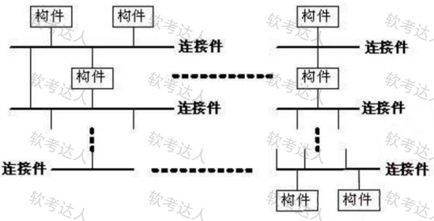

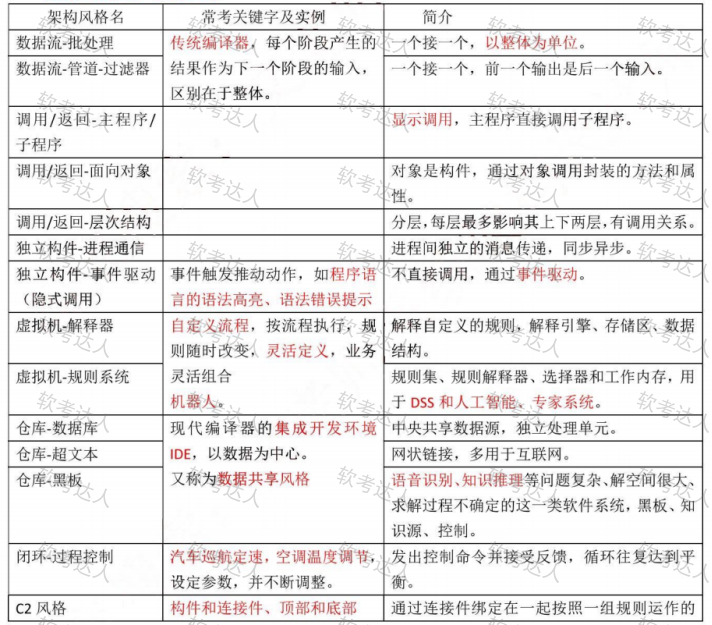

闭环结构能够进行替换与重用，但闭环结构通常适用于处理简单任务（如机器装配等），并不适用于复杂任务。分层结构的特点是通过引入抽象层，在较低层次不确定的实现细节在较高层次会变得确定，并能够组织层间构件的协作，系统结构更加清晰。

软件开发环境（Software Development Environment）是支持软件产品开发的软件系统。它由软件工具集和环境集成机制构成，前者用来支持软件开发的相关过程、活动和任务年；后者为工具集成和软件开发、维护和管理提供统一的支持，它通常包括数据集成、控制集成和界面集成。数据集成机制提供了存储或访问环境信息库的统一的数据接口规范；界面集成机制采用统一的界面形式，提供统一的操作方式；控制集成机制支持各开发活动之间的通信、切换、调度和协同工作。

### 13.3.3. 层次结构风格

两层C/S架构，客户端和服务器都有处理功能，相比较于传统的集中式软件架构，还是有不少优点的，但是现在已经不常用，原因有：开发成本较高、客户端程序设计复杂、信息内容和形式单一、用户界面风格不一、软件移植困难、软件维护和升级困难、新技术不能轻易应用、安全性问题、服务器端压力大难以复用。

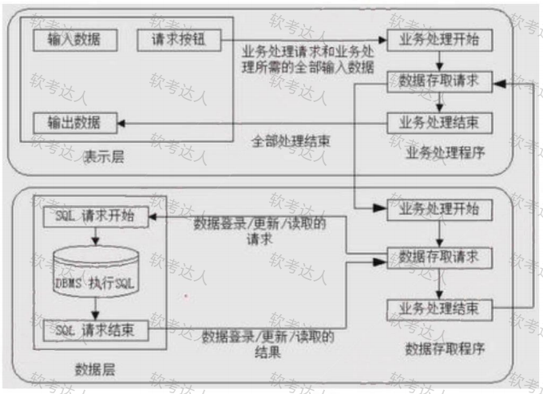

三层C/S架构，将处理功能独立出来，表示层和数据层都变得简单。表示层在客户机上，功能层在应用服务器上，数据层在数据库服务器上。即将两层C/S架构中的数据从服务器中独立出来了。

三层C/S架构其优点下面四点：

（1）各层在逻辑上保持相对独立，整个系统的逻辑结构更为清晰，能提高系统和软件的可维护性和可扩展性；

（2）允许灵活有效的选用相应的平台和硬件系统，具有良好的可升级性和开放性；

（3）各层可以并行开发，各层也可以选择各自最适合的开发语言；

（4）功能层有效的隔离表示层与数据层，为严格的安全管理奠定了坚实的基础，整个系统的管理层次也更加合理和可控制。

三层C/S架构设计的关键在于各层之间的通信效率，要慎重考虑三层间的通信方法、通信频度和数据量，否则即使分配给各层的硬件能力很强，性能也不高。

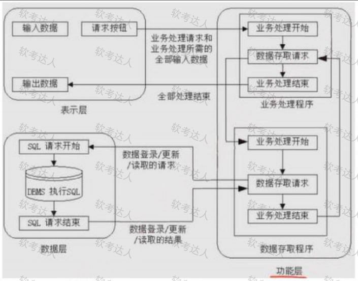

三层B/S架构：是三层C/S架构的变种，将客户端变为用户客户端上的浏览器，将应用服务器变为网上的WEB服务器，又称为0客户端架构，虽然不用开发客户端，但有很多缺点，主要是数据处理能力差：
(1)B/S架构缺乏对动态页面的支持能力，没有集成有效的数据库处理功能；
(2)安全性难以控制；
(3)在数据查询等响应速度上，要远远低于C/S架构；
(4)数据提交一般以页面为单位，数据的动态交互性不强，不利于OLTP应用。

混合架构风格,内外有别模型：企业内部使用C/S,外部人员访问使用B/S。

混合架构风格,查改有别模型：采用B/S查询，采用C/S修改。

混合架构风格,混合架构实现困难，且成本高。

富互联网应用RIA，弥补三层B/S架构存在的问题，RIA是一种用户接口，比用HTML实现的接口更加健壮，且有可视化内容，本质还是网站模式，其优点如下：

(1)RIA结合了C/S架构反应速度快、交互性强的优点与B/S架构传播范围广及容易传播的特性；

(2)RIA简化并改进了B/S架构的用户交互；

(3)数据能够被缓存在客户端，从而可以实现一个比基于HTML的响应速度更快且数据往返于服务器的次数更少的用户界面。

富互联网应用RIA本质还是0客户端，借助于高速网速实现必要插件在本地的快速缓存，增强页面对动态页面的支持能力，典型的如小程序。

MVC用户操作>View(负责接收用户的输入操作)->Controller(业务逻辑处理)->Model(数据持久化)->View(将结果反馈给View)。经典MVC架构如下图所示：

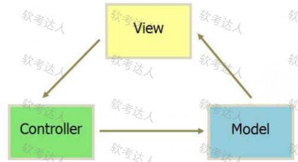

MVP是把MVC中的Controller换成了Presenter(呈现),目的就是为了完全切断View跟Model之间的联系，由Presenter充当桥梁，做到View-Model之间通信的完全隔离。

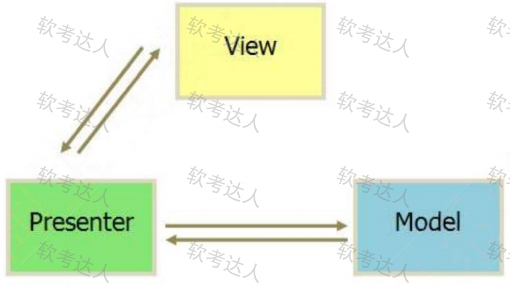

MVVM：如果说MVP是对MVC的进一步改进，那么MVVM则是思想的完全变革。它是将“数据模型数据双向绑定”的思想作为核心，因此在View和Model之间没有联系，通过ViewModel进行交互，而且Model和ViewModel之间的交互是双向的，因此视图的数据的变化会同时修改数据源，而数据源数据的变化也会立即反应到View上。

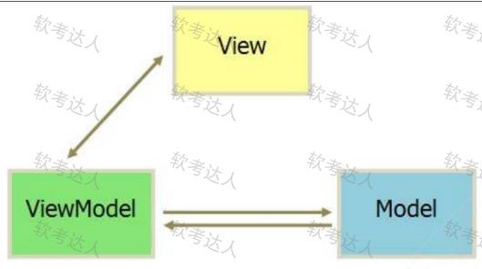

### 13.3.4. 面向服务的架构SOA

SOA是一种粗粒度、松耦合服务架构，服务之间通过简单、精确定义接口、进行通信，不涉及底层编程接口和通信模型。

在SOA中，服务是一种为了满足某项业务需求的操作、规则等的逻辑组合，它包含一系列有序活动的交互，为实现用户目标提供支持。

SOA并不仅仅是一种开发方法，还具有管理上的优点，管理员可直接管理开发人员所构建的相同服务。多个服务通过企业服务总线提出服务请求，由应用管理来进行处理，如下：

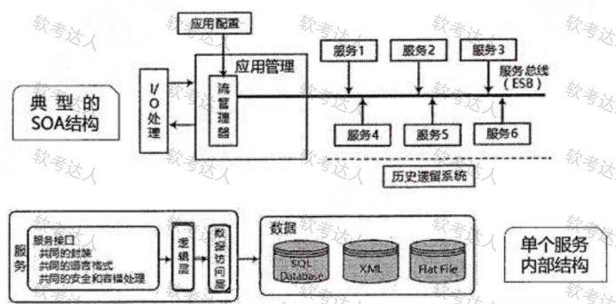

实施SOA的关键目标是实现企业IT资产重用的最大化，在实施SOA过程中要牢记以下特征：可从企业外部访问、随时可用(服务请求能被及时响应)、粗粒度接口(粗粒度提供一项特定的业务功能，而细粒度服务代表了技术构件方法)、服务分级、松散耦合(服务提供者和服务使用者分离)、可重用的服务及服务接口设计管理、标准化的接口(WSDL、SOAP、XML是核心)、支持各种消息模式、精确定义的服务接口。

从基于对象到基于构件再到基于服务，架构越来越松散耦合，粒度越来越粗，接口越来越标准。

基于服务的构件与传统构件的区别有四点：
(1)服务构件粗粒度，传统构件细粒度居多；
(2)服务构件的接口时标准的，主要是WSDL接口，而传统构件常以具体API形式出现；
(3)服务构件的实现与语言是无关的，而传统构件常绑定某种特定的语言；
(4)服务构件可以通过构件容器提供QoS的服务，而传统构件完全由程序代码直接控制。

**SOA中应用的关键技术如下表。**

**发现服务**
UDDI:用于Web服务注册和服务查找，描述了服务的概念，定义了编程的接口，供其他企业来调用。
DISCO:发现公开服务的功能及交互协议。

描述服务**WSDL**(WEB服务描述语言)协议：用于描述Web服务的接口和操作功能，描述网络服务。

消息格式层：SOAP为建立Web服务和服务请求之间的通信提供支持。

REST(RepresentationalStateTransfer,表述性状态转移)是一种只使用HTTP和XML进行基于Web通信的技术，可以降低开发的复杂性，提高系统的可伸缩性。

编码格式层，扩展标记语言(ExtensibleMarkupLanguage,XML)：用于标记电子文件使其具有结构性的标记语言，可以用来标记数据、定义数据类型，是一种允许用户对自己的标记语言进行定义的源语言。

WEBService：服务提供者、服务注册中心(中介，提供交易平台，可有可无)、服务请求者。服务提供者将服务描述发布到服务注册中心，供服务请求者查找，查找到后，服务请求者将绑定查找结果。如下图：

**WEBService分为六层：**底层传输层(负责底层消息的传输，采用HTTP、JMS、SMTP协议),服务通信协议层(描述并定义服务间通信的技术标准，采用SOAP和REST协议),服务描述层(采用WSDL协议),服务层(对企业应用系统进行包装，通过WSDL定义的标准进行调用),业务流程层(支持服务发现、服务调用和点到点的服务调用，采用WSDPEL标准),服务注册层(采用UDDI协议)。

**服务注册：**应用开发者(服务提供者)在注册表中公布服务的功能。

**服务位置：**服务使用者(服务应用开发者),帮助他们查询注册服务，寻找符合自身要求的服务。

** 服务绑定：**服务使用者利用检索到的服务接口来编写代码，所编写的代码将与注册的服务绑定，调用注册的服务，以及与它们实现互动。

服务注册表本质与WEBService类似，只是使用一个注册表来代替服务注册中心。

**企业服务总线ESB,客户端(服务请求者)、基础架构服务(中间件)、核心集成服务(提供服务)。本质也是通过网络，有下列六点功能：**  
(1)提供位置透明性的消息路由和寻址服务；  
(2)提供服务注册和命名的管理功能；  
(3)支持多种的消息传递范型；  
(4)支持多种可以广泛使用的传输协议；  
(5)支持多种数据格式及其相互转换；  
(6)提供日志和监控功能。

## 13.5. 特定领域软件架构DSSA

DSSA（特定领域软件架构）就是专用于一类特定类型的任务(领域)的、在整个领域中能有效地使用的、为成功构造应用系统限定了标准的组合结构的软件构件的集合。

DSSA就是一个特定的问题领域中支持一组应用的领域模型、参考需求、参考架构等组成的开发基础，其目标就是支持在一个特定领域中多个应用的生成。

垂直域：在一个特定领域中的通用的软件架构，是一个完整的架构。

水平域：在多个不同的特定领域之间的相同的部分的小工具(如购物和教育都有收费系统，收费系统即是水平域)。

DSSA的三个基本活动:

（1）领域分析：这个阶段的主要目标是获得领域模型(领域需求)。识别信息源，即整个领域工程过程中信息的来源，可能的信息源包括现存系统、技术文献、问题域和系统开发的专家、用户调查和市场分析、领域演化的历史记录等，在此基础上就可以分析领域中系统的需求，确定哪些需求是领域中的系统广泛共享的，从而建立领域模型。

（2）领域设计：这个阶段的目标是获得DSSA（特定领域软件架构）。DSSA描述在领域模型中表示的需求的解决方案，它不是单个系统的表示，而是能够适应领域中多个系统的需求的一个高层次的设计。建立了领域模型之后，就可以派生出满足这些被建模的领域需求DSSA。

（3）领域实现：这个阶段的主要目标是依据领域模型和DSSA开发和组织可重用信息。这些可重用信息可能是从现有系统中提取得到，也可能需要通过新的开发得到。

以上过程是一个反复的、逐渐求精的过程。在实施领域工程的每个阶段中，都可能返回到以前的步骤，对以前的步骤得到的结果进行修改和完善，再回到当前步骤，在新的基础上进行本阶段的活动。

参与DSSA的四种角色人员:

（1）领域专家：包括该领域中系统的有经验的用户、从事该领域中系统的需求分析、设计、实现以及项目管理的有经验的软件工程师等。提供关于领域中系统的需求规约和实现的知识，帮助组织规范的、一致的领域字典，帮助选择样本系统作为领域工程的依据，复审领域模型、DSSA等领域工程产品等等。

（2）领域分析人员：由具有知识工程背景的有经验的系统分析员来担任。控制整个领域分析过程，进行知识获取，将获取的知识组织到领域模型中。

（3）领域设计人员：由有经验的软件设计人员来担任。根据领域模型和现有系统开发出DSSA,并对DSSA的准确性和一致性进行验证。

（4）领域实现人员：由有经验的程序设计人员来担任。根据领域模型和DSSA,开发构件。

建立DSSA的过程:

(1)定义领域范围：领域中的应用要满足用户一系列的需求。

(2)定义领域特定的元素：建立领域的字典，归纳领域中的术语，识别出领域中相同和不相同的元素。

(3)定义领域特定的设计和实现需求的约束：识别领域中的所有约束，这些约束对领域的设计和实现会造成什么后果。

(4)定义领域模型和架构：产生一般的架构，并描述其构件说明。

(5)产生、搜集可复用的产品单元、：为DSSA增加复用构件，使可用于新的系统。

以上过程是并发的、递归的、反复的、螺旋型的。该过程的目的是将用户的需求映射为基于实现限制集合的软件需求，这些需求定义了DSSA。

DSSA的三层次系统模型:

（1）领域开发环境：领域架构师决定核心架构，产出参考结构、参考需求、架构、领域模型、开发工具。

（2）领域特定的应用开发环境：应用工程师根据具体环境来将核心架构实例化。

（3）应用执行环境：操作员实现实例化后的架构。

## 13.6. 系统质量属性与架构评估

### 13.6.1 软件系统质量属性

软件系统的质量就是“软件系统与明确地和隐含地定义的需求相一致的程度”。

可以将软件系统的质量属性分为开发期质量属性和运行期质量属性2个部分。

**开发期质量属性主要指在软件开发阶段所关注的质量属性，主要包含6个方面。**

(1)易理解性：指设计被开发人员理解的难易程度。

(2)可扩展性：软件因适应新需求或需求变化而增加新功能的能力，也称为灵活性。

(3)可重用性：指重用软件系统或某一部分的难易程度。

(4)可测试性：对软件测试以证明其满足需求规范的难易程度。

(5)可维护性：当需要修改缺陷、增加功能、提高质量属性时，识别修改点并实施修改的难易程度。

(6)可移植性：将软件系统从一个运行环境转移到另一个不同的运行环境的难易程度。

**运行期质量属性主要指在软件运行阶段所关注的质量属性，主要包含7个方面。**

(1)性能：性能是指软件系统及时提供相应服务的能力，如速度、吞吐量和容量等的要求。

(2)安全性：指软件系统同时兼顾向合法用户提供服务，以及阻止非授权使用的能力。

(3)可伸缩性：指当用户数和数据量增加时，软件系统维持高服务质量的能力。例如，通过增加服务器来提高能力。

(4)互操作性：指本软件系统与其他系统交换数据和相互调用服务的难易程度。

(5)可靠性：软件系统在一定的时间内持续无故障运行的能力。

(6)可用性：指系统在一定时间内正常工作的时间所占的比例。可用性会受到系统错误，恶意攻击，高负载等问题的影响。

(7)鲁棒性：是指软件系统在非正常情况(如用户进行了非法操作、相关的软硬件系统发生了故障等)下仍能够正常运行的能力，也称健壮性或容错性。

**面向架构评估的质量属性:**

1、性能：指系统的响应能力，即要经过多长时间才能对某个事件做出响应，或者在某段时间内系统所能处理的事件的个数。如响应时间、吞吐量。设计策略：优先级队列、增加计算资源、减少计算开销、引入并发机制、采用资源调度等。

2、可靠性：是软件系统在应用或系统错误面前，在意外或错误使用的情况下维持软件系统的功能特性的基本能力。如MTTF、MTBF。设计策略：心跳、Ping/Echo、冗余、选举。包括容错和健壮性。

3、可用性：是系统能够正常运行的时间比例，经常用两次故障之间的时间长度或在出现故障时系统能够恢复正常的速度来表示。如故障间隔时间。设计策略：心跳、Ping/Echo、冗余、选举。

4、安全性：是指系统在向合法用户提供服务的同时能够阻止非授权用户使用的企图或拒绝服务的能力。如保密性、完整性、不可抵赖性、可控性。设计策略：入侵检测、用户认证、用户授权、追踪审计。

5、可修改性：指能够快速的以较高的性能价格比对系统进行变更的能力。通常以某些具体的变更为基准，通过考察这些变更的代价衡量。包括可维护性、可扩展性、结构重组、可移植性。设计策略：接口-实现分类、抽象、信息隐藏。

6、功能性：是系统所能完成所期望的工作的能力。一项任务的完成需要系统中许多或大多数构件的相互协作。

7、可变性：指体系结构经扩充或变更而成为新体系结构的能力。这种新体系结构应该符合预先定义的规则，在某些具体方面不同于原有的体系结构。当要将某个体系结构作为一系列相关产品的基础时，可变性是很重要的。

8、互操作性：作为系统组成部分的软件不是独立存在的，经常与其他系统或自身环境相互作用。为了支持互操作性，软件体系结构必须为外部可视的功能特性和数据结构提供精心设计的软件入口。程序和用其他编程语言编写的软件系统的交互作用就是互操作性的问题，也影响应用的软件体系结构。

**质量属性场景是一种面向特定质量属性的需求。它由6部分组成：**

·刺激源(Source):这是某个生成该刺激的实体(人、计算机系统或者任何其他刺激器)。

·刺激(Stimulus):该刺激是当刺激到达系统时需要考虑的条件。

·环境(Environment):该刺激在某些条件内发生。当激励发生时，系统可能处于过载、运行或者其他情况。

·制品(Artifact):某个制品被激励。这可能是整个系统，也可能是系统的一部分。

·响应(Response):该响应是在激励到达后所采取的行动。

·响应度量(Measurement):当响应发生时，应当能够以某种方式对其进行度量，以对需求进行测试。

可修改性质量属性场景描述实例：

### 13.6.2 系统架构评估

系统架构评估是在对架构分析、评估、的基础上，对架构策略的选取进行决策。

软件架构评估在架构设计之后，系统设计之前，因此与设计、实现、测试都没有关系。评估的目的是为了评估所采用的架构是否能解决软件系统需求，但不是单纯的确定是否满足需求。

三种常用的评估方式:

(1)基于调查问卷(检查表)的方式：类似于需求获取中的问卷调查方式，只不过是架构方面的问卷，要求评估人员对领域熟悉。

(2)基于度量的方式：制定一些定量来度量架构，如代码行数等。要制定质量属性和度量结果之间的映射，要求评估人员对架构熟悉。涉及3个基本活动，首先需要建立质量属性和度量之间的映射原则，然后从软件架构文档中获取度量信息，最后根据映射原则分析推导出系统的质量属性。

(3)基于场景的方式：主要方法。首先要确定应用领域的功能和软件架构的结构之间的映射，然后要设计用于体现待评估质量属性的场景(即视图中的场景),最后分析软件架构对场景的支持程度。要求评估人员即对领域熟悉，也对架构熟悉。

三种评估方式的比较：

由上表可知，场景最不通用，度量要求对构架精确了解，调查问卷实施阶段最早，度量最客观。

其中，基于场景的方式是主流。

**架构评估中的重要概念:**  
敏感点：是指为了实现某种特定的质量属性，一个或多个构件所具有的特性。  
权衡点：是影响多个质量属性的特性，是多个质量属性的敏感点。

**风险点与非风险点不是以标准专业术语形式出现的，只是一个常规概念，即可能引起风险的因素，可称为风险点。**某个做法如果有隐患**，**有可能导致一些问题**，则为风险点；而**如果某件事是可行的可接受的，则为非风险点。

**从三个方面对场景进行设计：**刺激(事件);环境(事件发生的环境);响应(架构响应刺激的过程)。

### 13.6.3 基于场景的评估方法

**SAAM：**是一种非功能质量属性的架构分析方法，是最早形成文档并得到广泛应用的软件架构分析方法。

（1）特定目标。SAAM的目标是对描述应用程序属性的文档，验证基本的架构假设和原则。

（2）质量属性。这一方法的基本特点是把任何形式的质量属性都具体化为场景，但可修改性是SAAM分析的主要质量属性。

（3）架构描述。SAAM用于架构的最后版本，但早于详细设计。架构的描述形式应当被所有参与者理解。功能、结构和分配被定义为描述架构的3个主要方面。

（4）方法活动。SAAM的主要输入是问题描述、需求声明和架构描述。下图描绘了SAAM分析活动的相关输入及评估过程。包括5个步骤，即场景开发、架构描述、单个场景评估、场景交互和总体评估。

架构权衡分析法ATAM：让架构师明确如何权衡多个质量目标，参与者有评估小组、项目决策者和其他项目相关人。

ATAM被分为四个主要的活动领域，分别是场景和需求收集、体系结构视图和场景实现、属性模型构造和分析、折中。整个评估过程强调以属性作为架构评估的核心概念。主要针对性能、可用性、安全性和可修改性，在系统开发之前，对这些质量属性进行评价和折中。

ATAM方法采用效用树(Utilitytree)这一工具来对质量属性进行分类和优先级排序。效用树的结构包括：树根-质量属性-属性分类-质量属性场景(叶子节点)。需要注意的是，ATAM主要关注4类质量属性：性能、安全性、可修改性和可用性，这是因为这4个质量属性是利益相关者最为关心的。

成本效益分析法CBAM：用来对架构建立的成本来进行设计和建模，让决策者根据投资收益率来选择合适的架构，可以看做对ATAM的补充，在ATAM确定质量合理的基础上，再对效益进行分析。

有下列步骤：

(1)整理场景(确定场景，并确定优先级，选择三分之一优先级最高的场景进行分析);

(2)对场景进行细化(对每个场景详细分析，确定最好、最坏的情况);

(3)确定场景的优先级(项目干系人对场景投票，根据投票结果确定优先级);

(4)分配效用(对场景响应级别确定效用表，建立策略、场景、响应级别的表格);

(5)形成“策略-场景-响应级别的对应关系”;

(6)确定期望的质量属性响应级别的效用(根据效用表确定所对应的具体场景的效用表);

(7)计算各架构策略的总收益；

(8)根据受成本限制影响的投资报酬率选择架构策略(估算成本，用上一步的收益减去成本，得出收益，并选择收益最高的架构策略)。

其他评估方法(仅了解):

1.SAEM方法。将软件架构看作一个最终产品以及设计过程中的一个中间产品，从外部质量属性和内部质量属性两个角度来阐述它的评估模型，旨在为软件架构的质量评估创建一个基础框架。

外部属性指用户定义的质量属性，而内部属性指开发者决定的质量属性。该软件架构评估模型包

含以下几个流程。

(1)对待评估的质量属性进行规约建模。

(2)为外部和内部的质量属性创建度量准则，先从评估目的(如软件架构比较、最终产品的质量预测),评估角度(如开发者、用户、维护者),评估环境(架构作为最终产品或设计中间产品)出发来定义架构评估的目标，再根据目标相关的属性来提出问题，然后回答每个问题并提出相应的度量准则。

(3)评估质量属性，包括数据收集、度量和结果分析3个活动。

2.SAABNet方法。是一种用来表达和使用定性知识以辅助架构的定性评估。该方法来源于人工智能，允许不确定、不完整知识的推理。该方法使用BBN来表示和使用开发过程中的知识，包含定性和定量的描述，其中定性的描述是所有结点的图，定量的描述是每个结点状态相关的条件概率。

其中的变量可分为3类，即架构质量属性变量(如可维护性、灵活性等)、质量属性的度量准则变量(如容错性、响应性等)和架构特征变量(如继承深度、编程语言等),高层抽象的质量属性变量分解为低层抽象的度量准则变量，度量准则变量则分解为更低层抽象的架构特征变量。

3.SACMM方法。是一种软件架构修改的度量方法。

4.SASAM方法。通过对预期架构(架构设计阶段的相关描述材料)和实际架构(源代码中执行的架构)进行映射和比较来静态地评估软件架构。

5.ALRRA方法。是一种软件架构可靠性风险评估方法，该方法使用动态复杂度准则和动态耦合度准则来定义组件和连接件的复杂性因素，其中，动态复杂度准则在某个场景的执行中分析组件的动态行为来度量组件的复杂性，动态耦合度准则在某个场景的执行中分析连接件的消息传递协议来度量连接件的复杂性。利用失效模式和影响分析(FMEA)技术。

6.AHP(层次分析法)方法。是对定性问题进行定量分析的一种简便、灵活而、又实用的多准则决策方法。AHP方法的特点是把复杂问题中的各种因素通过划分为相联系的有序层次使之条理化，并在一般情况下通过两两对比，根据一定客观现实的主观判断结构，把专家意见和分析者的客观判断结果直接、有效地结合起来，将一定层次上元素的某些重要性进行定量描述，之后利用数学方法计算反映每一层次元素的相对重要性次序的权值，井最后通过所有层次之间的总排序计算所有元素的相对权重及对权重进行排序。

7.COSMIC+UML方法。基于度量模型来评估软件架构可维护性的方法。针对不同表达方式的软件架构，采用统一的软件度量COSMIC方法来进行度量和评估。该方法主要是为了辅助分析软件架构的演化方案是否可行，并在开源软件DCMMS的软件架构UML组件图上得以验证。

## 13.7 中间件技术

中间件是一种独立的系统软件或服务程序，可以帮助分布式应用软件在不同的技术之间共享资源。

**中间件特点:**  
负责客户机与服务器之间的连接和通信，以及客户机与应用层之间的高效率通信机制  
提供应用层不同服务之间的互操作机制，以及应用层与数据库之间的连接和控制机制。  
提供多层架构的应用开发和运行的平台，以及应用开发框架，支持模块化的应用开发。  
屏蔽硬件、操作系统、网络和数据库的差异。  
提供应用的负载均衡和高可用性、安全机制与管理功能，以及交易管理机制，保证交易的一致性。  
提供一组通用的服务去执行不同的功能，避免重复的工作和使应用之间可以协作。

**按照中间件在分布式系统中承担的职责不同，可以划分以下几类中间件产品:**

1)通信处理(消息)中间件

在分布式系统中，要建网和制定出通信协议，以保证系统能在不同平台之间通信，实现分布式系统中可靠的、高效的、实时的跨平台数据传输，这类中间件称为消息中间件，也是市面上销售额最大的中间件产品。

2)事务处理(交易)中间件

在分布式事务处理系统中，经常要处理大量事务，特别是OLTP中，每项事务常常要多台服务器上的程序按顺序协调完成，一旦中间发生某种故障，不但要完成恢复工作，而且要自动切换系统保证系统永不停机，实现高可靠性运行。要使大量事务在多台应用服务器上能实时并发运行，并进行负载平衡的调度，实现与昂贵的可靠性机和大型计算机系统的同等功能，为了实现这个目标，要求中间件系统具有监视和调度整个系统的功能。

3)数据存取管理中间件

在分布式系统中，重要的数据都集中存放在数据服务器中，它们可以是关系型的、复合文档型、具有各种存放格式的多媒体型，或者是经过加密或压缩存放的，该中间件将为在网络上虚拟缓冲存取格式转换、解压等带来方便。

4)Web服务器中间件

浏览器图形用户界面己成为公认规范，然而它的会话能力差，不擅长做数据的写入任务，受HTTP

协议的限制多等，就必须对其进行修改和扩充，因此出现了Web服务器中间件。

5)安全中间件

一些军事、政府和商务部门上网的最大障碍是安全保密问题，而且不能使用国外提供的安全措施(如防火墙、加密和认证等),必须用国产产品。产生不安全因素是由操作系统引起的，但必须要用中间件去解决，以适应灵活多变的要求。

6)跨平台和架构的中间件

当前开发大型应用软件通常采用基于架构和构件技术，在分布式系统中，还需要集成各结点上的不同系统平台上的构件或新老版本的构件，由此产生了架构中间件。功能最强的是CORBA,可以跨任意平台，但是其过于庞大；JavaBeans较灵活简单，很适合用于浏览器，但运行效率有待改善；COM+模型主要适合Windows平台，已在桌面系统广泛使用。由于国内新建系统多基于UNIX(包括Linux)和Windows,因此，针对这两个平台建立相应的中间件市场相对要大得多

7)专用平台中间件

专用平台中间件为特定应用领域设计领域参考模式，建立相应架构，配置相应的构件库和中间件，为应用服务器开发和运行特定领域的关键任务(如电子商务、网站等).

8)网络中间件

它包括网管、接入、网络测试、虚拟社区和虚拟缓冲等，也是当前最热门的研发项目。

**软件构件:** 构件又称为组件，是一个自包容、可复用的程序集。构件是一个程序集，或者说是一组程序的集合。构件的两个最重要的特性是自包容与可重用。

**构件组装模型的一般开发过程：** 设计构件组装、建立构件库、构建应用软件、测试与发布。

**商用构件标准规范-CORBA(公共对象请求代理体系结构)**

主要分为3个层次：对象请求代理、公共对象服务和公共设施。

最底层的对象请求代理(ORB)规定了分布对象的定义(接口)和语言映射，实现对象间的通信和互操作，是分布对象系统中的“软总线”;

在ORB之上定义了很多公共服务，可以提供诸如并发服务、名字服务、事务(交易)服务、安全服务等各种各样的服务；

最上层的公共设施则定义了构件框架，提供可直接为业务对象使用的服务，规定业务对象有效协作所需的协定规则。

**COREACCM构件模型是OMG组织制定的一个用于开发和配置分布式应用的服务器端构件模型规范，它主要包括如下3项内容。**

(1)抽象构件模型：用以描述服务器端构件结构及构件间互操作的结构。

(2)构件容器结构：用以提供通用的构件运行和管理环境，并支持对安全、事务、持久状态等系统服务的集成。

(3)构件的配置和打包规范：CCM使用打包技术来管理构件的二进制、多语言版本的可执行代码和配置信息，井制定了构件包的具体内容和文档内容标准。

**对象管理组织(OMG)基于CORBA基础设施定义了四种构件标准:**  
实体(Entity)构件需要长期持久化并主要用于事务性行为，由容器管理其持久化。  
加工(Process)构件同样需要容器管理其持久化，但没有客户端可访问的主键。  
会话(Session)构件不需要容器管理其持久化，其状态信息必须由构件自己管理。  
服务(Service)构件是无状态的。

CORBA对象可看作是一个具有对象标识、对象接口及对象实现的抽象实体。之所以称为抽象的，是因为并没有硬性规定CORBA对象的实现机制一个CORBA对象的引用又称可互操作的对象引用(InteroperableObjectReference)。从客户程序的角度看，IOR中包了对象的标识、接口类型及其他信息以查找对象实现。

对象标识(ObjectID)是一个用于在POA中标识一个CORBA对象的字符串。它既可由程序员指派，也可由对象适配器自动分配，这两种方式都要求对象标识在创建它的对象适配器中必须具有唯一性。

POA(便携式对象适配器)是对象实现与ORB其它组件之间的中介，支持由Objectld标识的对象的名称空间，它将客户请求传送到伺服对象，按需创建子POA,提供管理伺服对象的策略。

伺服对象(servant)是指具体程序设计语言的对象或实体，通常存在于一个服务程序进程之中。客户程序通过对象引用发出的请求经过ORB担当中介角色，转换为对特定的伺服对象的调用。在一个CORBA对象的生命期中，它可能与多个伺服对象相关联，因而对该对象的请求可能被发送到不同的伺服对象。

CORBA构件模型中，对象适配器的主要作用是在底层传输平台与接收调用并返回结果的对象实现之间进行协调，，目前采用的对象适配器规范是POA（可移植对象适配器），它替代了传统的BOA（基本对象适配器）。

Servant（伺服对象）是最终完成客户请求的服务对象实现，伺服对象管理器（伺服对象激活器和伺服对象定位器）用来提供CORBA服务端的对象查找服务，活动对象映射表用来保存已注册的CORBA对象标识和伺服对象之间的映射关系。

CORBA标准中，OMG接口定义语言IDL文件包含了六种不同的元素，包括模块定义、类型定义、常量定义、异常、接口描述和值类型，其中，接口描述是一个IDL文件最核心的内容，模块定义将被映射为Java语言中的包和C++语言中的命名空间。

